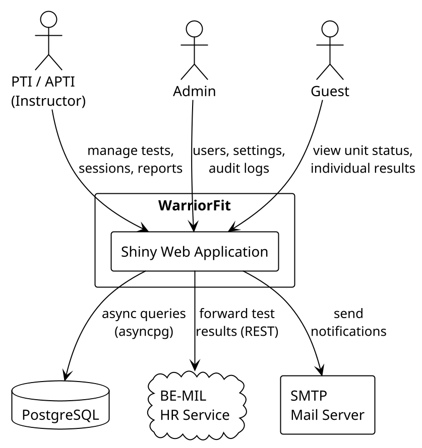
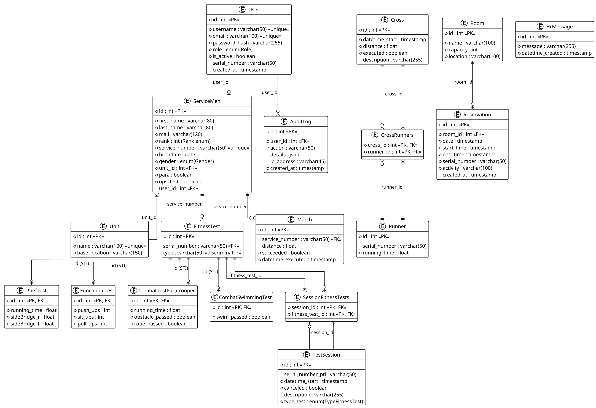
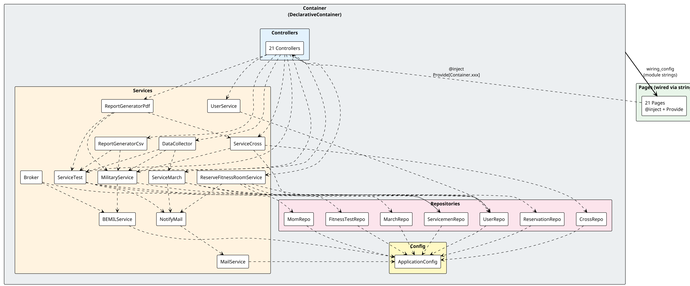

# WarriorFit - Architecture Design

## 1. Overview

WarriorFit is a military fitness test management application built with **Shiny for Python** (reactive web framework) and **SQLAlchemy** (async ORM). It manages fitness test sessions, servicemen data, cross-country runs, marches, room reservations, and integrates with an external HR system via a message queue.
### High-Level System Context



## 2. Project Structure

```
warriorfit/
  app.py                          # Application entry point
  config/
    appliccation_config.py        # Configuration loader (Singleton)
    config.yml / config_dev.yml   # YAML configuration files
    smtp_config.py                # SMTP mail settings dataclass
    settings_data.py              # Settings data container
    logging_configuration.yml     # Logging config
  core/
    container.py                  # DI Container (DeclarativeContainer)
    role.py                       # Role enum (ADMIN, PTI, APTI, GUEST, PLANNER)
    type_fitness_test.py          # TypeFitnessTest enum
    Gender.py                     # Gender enum
    rank_enum.py                  # Military rank enum
  data/
    model/
      db_model.py                 # SQLAlchemy ORM models
      enum_mapped_user_model.py   # Custom enum type for SQLAlchemy
    repositories/
      abc_repository.py           # Base repository (async session management)
      user_repository.py          # User CRUD operations
      servicemen_repository.py    # ServiceMen CRUD operations
      fitness_test_repository.py  # Fitness test CRUD operations
      cross_repository.py         # Cross/run CRUD operations
      march_repository.py         # March CRUD operations
      reservation_repository.py   # Room reservation CRUD operations
      mom_repositor.py            # Message queue persistence
  services/
    service.py                    # Base service (ABC)
    service_user.py               # User management service
    service_test.py               # Fitness test service
    service_cross.py              # Cross/run service
    service_march.py              # March service
    reserve_fitness_room_service.py  # Room reservation service
    military_service.py           # Military/servicemen management
    be_mil_service.py             # External HR API integration
    data_collector.py             # Aggregates data from multiple services
    mail_service.py               # Email sending service
    report_generator_pdf.py       # PDF report generation
    report_generator_csv.py       # CSV report generation
  mom/
    broker.py                     # Message queue broker (async worker)
    message.py                    # Message dataclass
  ui/
    user_store.py                 # In-memory logged-in user store (Singleton)
    pages/
      page.py                     # Page ABC base class
      base_test_page.py           # Extended base for fitness test pages
      phef.py                     # PHEF test page
      combat_test.py              # Combat test page
      functional_test.py          # Functional test page
      swim_test.py                # Swimming test page
      mfft_eval.py                # MFFT Eval page (8-event evaluation)
      test_analytics.py           # Test Analytics page (cohort diagnostics)
      march.py                    # March page
      cross.py                    # Cross test page
      cross_planning.py           # Cross planning page
      cross_statics.py            # Cross statistics page
      sessions.py                 # Test sessions management page
      own_unit.py                 # Unit overview page
      dashboard_own_unit.py       # Unit dashboard page
      ind_test_show.py            # Individual test results page
      usermangement.py            # User management (admin)
      settings.py                 # Application settings (admin)
      status_application.py       # Application status (admin)
      auditlog_events.py          # Audit logs (admin)
      calendar_events.py          # Calendar view
      reserve_fitness_room.py     # Room reservation page
      reports.py                  # Report generation page
      status_tests.py             # Status of non-completed tests
      status_login_user.py        # Welcome/login status page
      notify_mail.py              # Email notification helper
    controllers/
      phef_controller.py          # (21 controller files, one per page)
      ...
  logic/
    phef_calculator.py            # PHEF test scoring logic
    Functional_calculator.py      # Functional test scoring logic
    mfft_eval_calculator.py       # MFFT Eval scoring (8 events × 5 clusters)
    singleton.py                  # Singleton metaclass
  security/
    auth_service.py               # Authentication (bcrypt + JWT setup)
  utils/
    Os.py                         # OS utilities (project root, IP)
    formaters.py                  # Formatting helpers
    BenchmarkDecorator.py         # Performance measurement decorator
```

---

## 3. Layered Architecture

### Component Tier Diagram


### 3.1 Presentation Layer (Pages)

**Location**: `warriorfit/ui/pages/`

Pages are the top-level UI components. Each page defines:
- `get_ui()` - Returns Shiny UI elements (nav panels, cards, inputs, buttons)
- `server(input, output, session)` - Registers reactive effects, renders, and event handlers
- `refresh()` - Called when the page tab becomes active

**Base classes:**

| Class | File | Purpose |
|-------|------|---------|
| `Page` (ABC) | `page.py` | Defines `get_ui()`, `server()`, `refresh()`. Provides `refresh_tick` reactive value and `refresh_on_nav()` helper |
| `BaseTestPage` | `base_test_page.py` | Extends `Page` for fitness test pages. Adds session/military selection management, serial search, form clearing hooks |

**Lazy instantiation pattern** - All pages use deferred construction to ensure DI wiring completes before page constructors run:

```python
_page = None

def _get_page():
    global _page
    if _page is None:
        _page = PhefPage()  # @inject triggers here, after wiring
    return _page

def get_ui():
    return _get_page().get_ui()

def server(input, output, session):
    _get_page().server(input, output, session)
```

### 3.2 Controller Layer

**Location**: `warriorfit/ui/controllers/`

Controllers contain business logic and data transformation. They:
- Receive services via constructor kwargs (plain kwargs with `None` fallback)
- Transform domain objects to DataFrames for page display
- Validate form inputs
- Orchestrate service calls

```python
class PhefController:
    def __init__(self, service: ServiceTest = None, mil_service: MilitaryService = None):
        self._service = service if service is not None else ServiceTest()
        self._mil_service = mil_service if mil_service is not None else MilitaryService()
```

### 3.3 Service Layer

**Location**: `warriorfit/services/`

Services implement core business operations. The base class `Service` (ABC) provides:
- Async database session management (`SessionLocal`)
- Audit logging (`add_audit_log()`)
- References to `UserRepository` and `MilitaryService`

```python
class Service(ABC):
    def __init__(self, user_repository=None, military_service=None, config=None):
        # DI with fallbacks
```

**Specialized services:**

| Service | Responsibility |
|---------|---------------|
| `ServiceTest` | PHEF, functional, combat, swimming, MFFT Eval test CRUD + session management |
| `ServiceCross` | Cross/run events and runner management |
| `ServiceMarch` | March test management |
| `UserService` | User CRUD, authentication checks |
| `MilitaryService` | Servicemen lookup, unit-scoped queries |
| `BEMILService` | External HR API client |
| `ReserveFitnessRoomService` | Room booking logic |
| `DataCollector` | Aggregates data from test + march + military services |
| `MailService` | SMTP email sending |
| `ReportGeneratorPdf` | PDF report creation |
| `ReportGeneratorCsv` | CSV export |

### 3.4 Repository Layer

**Location**: `warriorfit/data/repositories/`

Repositories handle all database operations using async SQLAlchemy. The base class `ABCRepository` provides:
- Async session factory (`SessionLocal`) from `ApplicationConfig`
- `fetch_and_log()` - Generic query executor with error logging
- `check_if_db_is_operational()` - Connection health check
- Audit log methods (`create_audit_log`, `get_audit_logs`)

```python
class ABCRepository:
    def __init__(self, config: ApplicationConfig = None):
        if config is None:
            config = ApplicationConfig()
        async_engine = config.config
        self.SessionLocal = async_sessionmaker(bind=async_engine, ...)
```

**Repositories:**

| Repository | Domain |
|------------|--------|
| `UserRepository` | Users, roles, password management |
| `ServicemenRepository` | Service members (military personnel) |
| `FitnessTestRepository` | All fitness test types (polymorphic) |
| `CrossRepository` | Cross/run events and runners |
| `MarchRepository` | March tests |
| `ReservationRepository` | Room reservations |
| `MomRepository` | HR message queue persistence |

### 3.5 Data Model Layer

**Location**: `warriorfit/data/model/db_model.py`

All ORM models use SQLAlchemy 2.0 `DeclarativeBase` with `Mapped[]` type annotations.

**Entity Relationship Diagram:
### Entity Relationship Diagram



**Key models**: `User`, `ServiceMen`, `FitnessTest` (+ subtypes), `TestSession`, `Cross`, `Runner`, `March`, `Room`, `Reservation`, `HrMessage`, `AuditLog`, `Unit`

---

## 4. Dependency Injection

### Dependency Injection Wiring


### 4.1 Framework

The application uses the **`dependency-injector`** library with a `DeclarativeContainer`.

**Container file**: `warriorfit/core/container.py`

### 4.2 Provider Hierarchy

All providers are `Singleton` instances, built in dependency order:

```
Configuration
  ApplicationConfig

Repositories (depend on config)
  UserRepository, ServicemenRepository, FitnessTestRepository,
  CrossRepository, MarchRepository, ReservationRepository, MomRepository

External Services (depend on config/repos)
  BEMILService, MilitaryService

Infrastructure (depend on repos/services)
  Broker, MailService, NotifyMail

Application Services (depend on repos/services)
  UserService, ServiceTest, ServiceCross, ServiceMarch,
  ReserveFitnessRoomService

Composite Services
  DataCollector, ReportGeneratorPdf, ReportGeneratorCsv

Controllers (depend on services)
  21 controller singletons (PhefController, CrossController, ...)
```

### 4.3 Wiring Strategy

```
Container imports:           repos, services, controllers (direct Python imports)
Container wiring_config:     21 page modules (string references)
```

**Circular import prevention:**
- The Container **directly imports** all repos, services, and controllers (they do NOT import Container)
- Pages are listed as **module strings** in `wiring_config`, so they CAN safely import Container
- Pages use `@inject` + `Provide[Container.xxx_controller]` to receive controllers

**Constructor patterns:**

| Layer | Pattern | Example |
|-------|---------|---------|
| Repos/Services | Plain kwargs with `None` fallback | `def __init__(self, config=None)` |
| Controllers | Plain kwargs with `None` fallback | `def __init__(self, service=None)` |
| Pages | `@inject` + `Provide[Container.xxx]` | `@inject def __init__(self, ctrl=Provide[Container.phef_controller])` |

### 4.4 Initialization Order

In `app.py`:

```python
# 1. Create & wire the container (patches @inject in all wiring_config modules)
_container = Container()

# 2. Import pages (AFTER wiring - page module code runs, but constructors are lazy)
from warriorfit.ui.pages import phef, cross, ...

# 3. Start the broker background task
FitnessWarriorApp.get_broker().start()

# 4. Create the Shiny App
app = App(ui=FitnessWarriorApp.build_app_ui(), server=FitnessWarriorApp.server)
```

---

## 5. Application Entry Point

**File**: `warriorfit/app.py`

### 5.1 `FitnessWarriorApp`

The main application class manages:
- **Page registry**: `_pages()` returns a list of `PageSpec` objects
- **Role-based access**: `_pages_for_role(role)` filters pages by `allowed_roles`
- **Navbar construction**: `build_main_navbar()` builds navigation based on user role
- **Login/logout flow**: Modal-based login, session management, auto-logout after 10 min
- **Lazy page server mounting**: Tab servers are mounted only when first visited

### 5.2 `PageSpec`

```python
@dataclass(frozen=True)
class PageSpec:
    tab: str                                  # Tab display name
    group: str                                # "root" | "Psychical Tests" | "Cross/Runs" | "Admin"
    ui_factory: Callable[[], Optional[Any]]   # get_ui function
    server_factory: Callable                  # server function
    allowed_roles: set[Role]                  # Which roles can see this tab
```

### 5.3 Navigation Groups

| Group | Tabs | Roles |
|-------|------|-------|
| root | Welcome, Dashboard, Status Unit, Individual, Reports, Reserve Room, Sessions | ADMIN, PTI, APTI (varies) |
| Psychical Tests | PHEF, Combat, Functional, Swimming, MFFT Eval, Analytics, March, PHEF Not done, Sessions | ADMIN, PTI, APTI |
| Cross/Runs | Cross Statics, Cross Planning, Cross | ADMIN, PTI, APTI |
| Admin | Audit Logs, User Management, Settings, Status Application | ADMIN only |

---

## 6. Database

- **Engine**: PostgreSQL with **asyncpg** driver
- **ORM**: SQLAlchemy 2.0 (async, `DeclarativeBase`)
- **Session factory**: `async_sessionmaker(bind=engine, expire_on_commit=False, class_=AsyncSession)`
- **Connection pooling**: pool_size=20, max_overflow=30, pool_recycle=3600, pool_pre_ping=True

### Configuration

Database settings are loaded from YAML config files, selected by `APP_ENV`:
- `development` -> `config_dev.yml`
- `production` -> `/etc/WarriorFit/config.yml`
- `test` -> `config_test.yml`

---

## 7. Message Queue (MOM)

**Location**: `warriorfit/mom/`

The `Broker` class provides an async message queue for forwarding fitness test results to an external HR system.


**DTOs**: `PhefTestDto`, `CombatTestDto`, `CombatSwimTestDto`, `MarchTestDto`, `FunctionalTestDto` - serialize test results to JSON for the HR API.

---

## 8. Authentication & Authorization

### Authentication
- **Password hashing**: bcrypt (`security/auth_service.py`)
- **Login flow**: Modal dialog -> `UserService.check_user()` -> set session user
- **Session management**: User stored on `session.user` attribute and `UserStore` singleton
- **Auto-logout**: 10-minute inactivity timer with JS activity probing

### Authorization
- **Role enum**: `ADMIN`, `PTI`, `APTI`, `GUEST`, `PLANNER`
- **Page-level access**: Each `PageSpec` defines `allowed_roles`
- **Navbar filtering**: `_pages_for_role(role)` only shows tabs for the user's role

---

## 9. Configuration

**File**: `warriorfit/config/appliccation_config.py` (Singleton metaclass)

`ApplicationConfig` loads from YAML and exposes:
- `config` - SQLAlchemy async engine
- `own_unit` - Military unit name
- `pdf_output_path` - PDF export directory
- `hr_url` / `hr_api_key` - HR API connection
- `mail_server` - SMTP configuration (`SmtpConfig`)
- `version` - Application version info
- `settings_data` - Full `SettingsData` object

---

## 10. Key Design Patterns

| Pattern | Usage |
|---------|-------|
| **Singleton** | `ApplicationConfig`, `UserStore` (metaclass), all DI providers (Container Singletons) |
| **Dependency Injection** | `dependency-injector` Container with wired pages |
| **Repository** | `ABCRepository` base with async session management |
| **Abstract Base Class** | `Page`, `BaseTestPage`, `Service` |
| **Polymorphic Inheritance** | `FitnessTest` -> PhefTest, FunctionalTest, CombatTestParatrooper, CombatSwimmingTest, MfftEvalTest (joined-table inheritance via `type` discriminator) |
| **Derived Cluster** | `ServiceMen.cluster` is a `@property` (not a column): paratroopers → `Cluster.COMBAT`, everyone else → `Cluster.ENABLER`. Used by `MfftEvalCalculator` to pick the scoring scale. |
| **Observer/Reactive** | Shiny reactive values, effects, and event handlers |
| **Message Queue** | `Broker` with async worker task for HR message delivery |
| **DTO** | Test DTOs in `broker.py` for HR API serialization |
| **Lazy Initialization** | Page module-level `_get_page()` pattern |
| **Factory Method** | `PageSpec.ui_factory` / `server_factory` for page construction |

---
