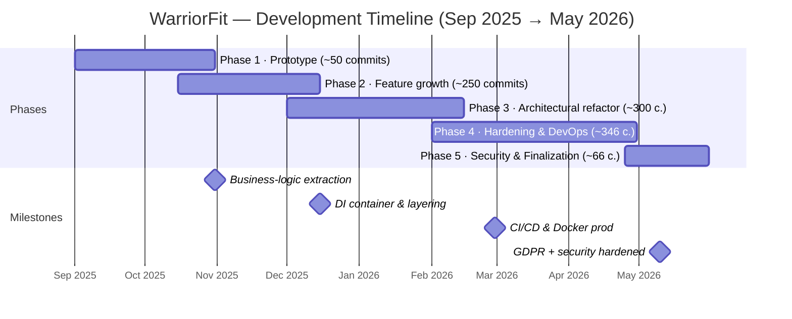
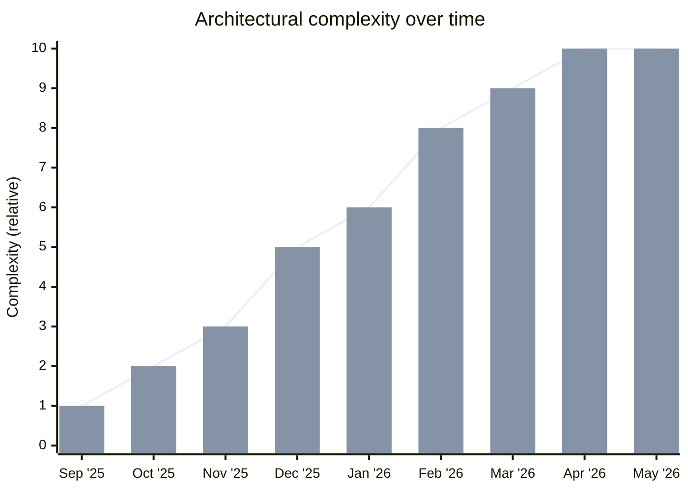
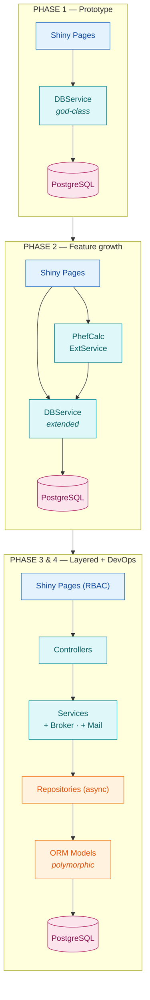

# 🛡️ WARRIORFIT

### Digitization of Physical Military Tests at SOR-Unit Level

**Author:** Benoit Goethals

**Academic Year:** 2025–2026

**Project Status:** Final phase — security hardened, GDPR-compliant, preparing for delivery

**Project Type:** Software Engineering

**Project Duration:** 6 months

**Project Language:** Python

**Project development methodology:** Agile

**Project Development server:** https://test.warriorfit.bensoft.be/
username: tester
password: Tester@1401!

**Test mailserver view : https://mailstub.bensoft.be/
**Test HR Simulator view : https://api.bensoft.be/

Final view of the Architecture -> [Architectural Structure](documentation/ARCHITECTURE.md)

## Updates
* 2025-09-1: Project started
* 2025-10-30: all user stories done 
* 2025-11-15: extra user stories for cross management done
* 2025-11-30 Room reservation done
* 2025-12-01: HRM SIMULATOR done
* 2025-12-12: Prof of concept WarriorFit cross app done
* 2025-12-13: video demo done 
* 2026-01-04: Project first release ready for testing
* 2026-01-11: Start testing, test cases 
* 2026-01-18: Testing completed, release to 1.0 RC
* 2026-01-19: added search in tests sessions
* 2026-01-27: update retrospective
* 2026-01-27: demo video uploaded https://youtu.be/wZveSgpKTf8
* 2026-01-28: make HRM simulator API secure with key:
* 2026-02-01: setup nginx reverse proxy
* 2026-02-02: Cross app and api SSL/HTTPS Support**: Encrypted communication with SSL certificates
* 2026-02-03: versioning by git hook pre-commit
* 2026-02-07 : update cross app and rest api with 2oauth and certificates
* 2026-02-13 : Big refactoring, use Dependency Injection [DI Usage Guide](documentation/DI_USAGE_GUIDE.md)
* 2026-02-14 : Add Architectural structure document [Architectural Structure](documentation/ARCHITECTURE.md)
* 2026-02-14 : Bug fix container.py (DI wiring)
* 2026-02-14 : Update cross app documentation [Cross App](documentation/crsossapp.md)
* 2026-02-15 : refactor security + audit security
* 2026-03-18 : security hardening — remove Fernet, migrate to bcrypt, fix audit log nullable user_id, add SECURITY.md
* 2026-03-19 : migrate password hashing from bcrypt to Argon2id, remove bcrypt/passlib dependencies
* 2026-03-19 : fix Docker read-only volume mount — settings can now be saved from the UI in production
* 2026-03-20 : modern UI/UX redesign — custom CSS design system (navy/amber theme, `www/custom.css`), 
  consistent button colours (Refresh, Confirm Serial, Search own Unit) across all pages, 
  login modal error feedback fixed, User Management sidebar restructured, 
  Plotly chart fix on Dashboard tab switch, 
  Reserve Room renamed to Sport Area, reservation overlay CSS fixed
* 2026-03-21 : update video demo
* 2026-03-21 : add runtime memory & process metrics dashboard (RSS, VMS, CPU, threads, uptime) on Status Application page using `psutil`
* 2026-03-21 : clarify reactive refresh strategy — `refresh_tick` for DataGrids (event-driven), `reactive.invalidate_later` for live metrics only
* 2026-03-22 : Chronos XML import for cross results — upload race XML, validate against XSD, bulk-save runner times, auto-set `Cross.executed = True`; `lxml` added as dependency
* 2026-03-29 : add [User Manual](documentation/USER_MANUAL.md) — step-by-step guide for all user roles (Admin, PTI, APTI, Planner, Guest)
* 2026-04-25 : GDPR compliance pass — serviceman-scoped consent table (`user_consents` keyed by `service_number`),
  Privacy self-service page (Art. 7 grant/withdraw, Art. 15/20 JSON export incl. test dates),
  serviceman login mode, "My Progress" page (USER role) with PHEF chart,
  data-retention service, and GDPR docs ([Privacy Policy](documentation/compliance/PRIVACY_POLICY.md), [DPIA](documentation/compliance/DPIA.md))
* 2026-04-25 : new Admin → "Servicemen Overview" page — all servicemen with fields and per-consent grant status
* 2026-04-27 : Cross Statistics redesign — KPI strip + 8-tab layout (Overview, Per cross, Best 10, Demographics, Runners, Trends, Podium, Data quality);
  new metrics: per-cross median/std/pace/turnout, per-runner PB/race count/improvement, age-group × distance best & avg,
  gender split per distance, chronological trends, podium frequency, data-quality flags (unmatched serials, never-raced);
  best/avg/median now broken down per distance (no more meaningless 5K+10K aggregation), top-N deduplicated by serial,
  full mypy clean across the codebase
* 2026-04-27 : broker hardening — exponential back-off on retries, batch-send support, dead-letter queue for permanently failed messages (PR #211);
  transactional outbox pattern documented
* 2026-04-27 : military UI theme — Rajdhani + JetBrains Mono fonts, olive-drab / khaki / amber colour system applied across all pages;
  Dashboard redesigned with side-by-side charts and a Broker / HR System health card
* 2026-04-30 : NIST CSF 2.0 compliance self-assessment added; PostgreSQL SSL/TLS enabled with `db.ssl_root_cert` certificate validation (file-existence check at startup)
* 2026-04-30 : comprehensive unit tests for Broker module — DTO mappings, lifecycle management, messaging logic
* 2026-05-01 : code quality refactor — fixed 5 filename typos (`appliccation_config`, `usermangement`, `mom_repositor`, `cross_plannig_controller`, `StatusApplicationController`);
  split 1 023-line `app.py` monolith into `page_registry.py`, `app_server.py`, and a thin entry-point `app.py`;
  moved `notify_mail.py` from `ui/pages/` to `services/`;
  corrected navbar label "Psychical Tests" → "Physical Tests";
  applied `@inject` + `Provide[Container.xxx]` throughout the full application — `make_server()`, all service/broker/controller method-level instantiations replaced with injected instance variables
* 2026-05-01 : added core repository docs — detailed `ARCHITECTURE.md`, `ASSETS.md`, `CODEOWNERS`, `LICENSE`; added `WarriorFit_Presentation.pptx`
* 2026-05-10 : security hardening pass —
  authenticate MOM ingestion endpoint (`/api/v1/phef/test`) with `X-API-Key` (`WF_MOM_API_KEY`, constant-time compare, fail-closed),
  lock down CORS (methods/headers restricted, origins via `WF_MOM_CORS_ORIGINS`),
  require `WF_MOM_API_KEY` in `deploy-test.sh` / `deploy-prod.sh`,
  fix IDOR on test deletes by adding server-side role guard `_assert_can_modify_tests()` in `services/service_test.py`,
  drop GUEST role from "Status Unit" and "Individual" pages,
  scope `UserStore` to the active Shiny session (PR #217) — no more cross-session identity leak;
  see [SECURITY.md](SECURITY.md) for the updated OWASP Top 10 assessment
* 2026-05-31 : broker dead-letter email alerts — `Broker` emails an operator when a message exhausts its retries
  (`broker_alert_email` config key, `NotifyMail` injected via DI); expanded page/class docstrings across `ui` and `pages`
* 2026-06-05 : internationalization (i18n) — new `warriorfit/i18n/` module with per-session `LanguageStore`,
  `t()` translation helper, and EN/NL/FR catalogs (~498 keys each); all pages and navbar migrated to translation keys
* 2026-06-06 : navbar redesign — language switcher converted from three off-screen EN/NL/FR buttons to a single
  dropdown (`lang_select`); `Status Unit`, `Individual`, `Reports` moved under the `Physical Tests` menu; empty navbar-brand glyph removed

## Project Description
WarriorFit is a comprehensive fitness and military management application designed to track physical performance, manage personnel data, and generate analytical reports. The system integrates data collection, statistical analysis, and reporting capabilities tailored for military fitness standards.
Each unit within Defence has a **physical training cell** aimed at preparing soldiers physically for operational deployment.
Annually, every soldier must complete the **PHEF** (Physical Fitness Evaluation Defence). In addition, combat units carry out **functional** and **combat tests**, while paracommandos must endure additional **combat evaluations**.

Since 2026, the Land Component also runs the **Eval MFFT** ("Military Functional Fitness Test"). It is an 8-event evaluation grouped in 3 blocks — a 6-minute EMOM (pull-ups, burpees step-over, farmer walk, hand-and-release push-ups, casualty drag, sandbag carry), a timed 4 800 m combat run, and a 200 m combat swim. Results are scored against tiered thresholds (GOLD / SILVER / BRONZE / FIT / UNFIT). Each soldier is assigned an MFFT cluster automatically from their `para` flag: paratroopers are scored on the **COMBAT** scale, all other personnel on the **ENABLER** scale.
Currently, much of this process is manual, leading to inefficiency, errors, and administrative delays.

The system includes user management, test input, calculations, PDF reporting, and email distribution. It is designed for local server deployment within Defense.

## Project Demo
https://youtu.be/wZveSgpKTf8

## Code Evolution

**1 012 commits** over ~8 months (Sep 2025 – May 2026) — currently ~25,800 lines of Python.

### Timeline

### Complexity Growth

| Phase | Period | Complexity | Architecture |
|---|---|---|---|
| 1 — Prototype | Sep–Oct 2025 | low | Monolith |
| 2 — Features & Calculators | Oct–Dec 2025 | mid | Emerging layers |
| 3 — Layered DI | Dec 2025–Feb 2026 | high | DI container |
| 4 — Hardening & CI/CD | Feb–Apr 2026 | high | Production-ready |
| 5 — Security & Finalization | Apr–May 2026 | high | OWASP-hardened, GDPR-compliant |

### Architecture Evolution

> Phase 3 & 4 also bring: **DI Container · CI/CD pipeline · Docker · MkDocs**.
> Phase 5 adds: **OWASP hardening · GDPR compliance · NIST CSF 2.0 · PostgreSQL TLS · military UI theme**.

### Phase 1: Prototype (Sep–Oct 2025) — commits 1–~50

**Complexity: low | Architecture: monolithic**

- Single Shiny app with a few pages, flat file structure
- `DBService` as a god-class handling all database operations
- Direct database calls from UI pages
- No DI, no layering — pages talk directly to the service
- Rudimentary login/auth (Argon2 password hashing introduced early)
- Heavy iterative refactoring on the same pages (PhefPage had dozens of commits)
- First Alembic migration, base models with polymorphic `FitnessTest`

### Phase 2: Feature Growth (Oct–Dec 2025) — commits ~50–300

**Complexity: medium | Architecture: emerging layers**

- New pages: CombatPage, DashboardPage (with Plotly), SessionsPage
- `PhefCalculator` introduced — first business logic extracted from UI
- `DefenseExternalService` (singleton) for external HR integration
- Role-based access control (6 roles: ADMIN, PTI, APTI, PLANNER, GUEST, USER)
- Config via YAML with `Singleton` metaclass pattern
- Still a lot of logic residing in page classes

### Phase 3: Architectural Refactor (Dec 2025–Feb 2026) — commits ~300–600

**Complexity: high | Architecture: layered DI architecture**

- **Major turning point**: introduction of `dependency-injector` (`DeclarativeContainer`)
- Clear separation into layers: **UI → Controllers → Services → Repositories → Models**
- Repositories using `async_sessionmaker` with `AsyncSession`
- Message broker (`mom/broker.py`) for async background processing (HR integration)
- Mail service with SMTP health checks
- Audit logging system
- Cross-run reports and PDF generation
- Reservation system added
- Unit tests (pytest) with singleton isolation

### Phase 4: Hardening & DevOps (Feb–Apr 2026) — commits ~600–946

**Complexity: high | Architecture: production-ready**

- CI/CD: GitHub Actions with Ruff, mypy strict mode, formatting checks
- Docker production configuration (`SHINY_DEV_MODE=false`, secret management)
- MkDocs documentation
- OWASP security review and fixes
- Code quality: `ruff check`, `mypy strict`, `black` formatting
- Type annotations across the entire codebase
- PR workflow via GitHub (merge requests, code review)

### Phase 5: Security & Finalization (Apr–May 2026) — commits ~946–1 012

**Complexity: high | Architecture: OWASP-hardened, GDPR-compliant**

- GDPR compliance: serviceman consent table, Privacy self-service page (Art. 7/15/20), data-retention service
- NIST CSF 2.0 self-assessment; PostgreSQL SSL/TLS with certificate validation
- OWASP hardening: authenticated MOM endpoint (`X-API-Key`), IDOR fix on test deletes, GUEST role scope reduction, `UserStore` scoped per Shiny session (PR #217)
- Military UI theme: Rajdhani + JetBrains Mono fonts, olive-drab / khaki / amber colour system
- Broker resilience: exponential back-off, batch send, dead-letter queue; comprehensive unit tests
- Dashboard redesign: side-by-side charts, Broker / HR System health card
- Core docs added: `ARCHITECTURE.md`, `ASSETS.md`, `CODEOWNERS`, `LICENSE`

### Evolution Summary

| Aspect | Start | Now |
|---|---|---|
| **Structure** | Flat files | 7+ packages, layered |
| **DI** |  | `DeclarativeContainer` |
| **DB access** | God-class `DBService` | Repository pattern, async |
| **Business logic** | Inside UI pages | Calculators, Services, Controllers |
| **Auth** | Simple login | RBAC with 6 roles, OWASP-hardened |
| **Testing** |  | Pytest with DB isolation + Broker unit tests |
| **CI/CD** |  | GitHub Actions, Docker |
| **Docs** |  | MkDocs site, ARCHITECTURE.md, DPIA, Privacy Policy |
| **Compliance** |  | GDPR (Art. 7/15/20), NIST CSF 2.0, PostgreSQL TLS |

The pattern is classic and healthy: **working prototype → add features → architectural restructuring → harden for production → compliance & security**. The biggest leaps in maturity were the introduction of dependency injection (Phase 3) and the OWASP/GDPR hardening pass (Phase 5) — transforming it from a "script that works" into a production-ready, security-audited application.

---

## Project Goals
The main goals of this project are:
* To develop a comprehensive fitness military management application
* To integrate data collection, statistical analysis, and reporting capabilities tailored for military fitness standards

* To integrate with existing Defence systems (HRM)
* To integrate with existing Defence systems (SIMULATOR)

## Project Development Methodology
The project is developed using Agile methodology and SOLID principles.
Using Epic and User Stories, the project is divided into different Epic implementations. With as goal to deliver a working product at the end of each epic implementation.
The project is developed using Github.
The project is managed using Github.

## 1. Project Structure (click links)
The project documentation is structured in different documents:
1. * [Design](documentation/Design.md) (Done)
2. * [Business Logic](documentation/business_logic.md) (Done)
3. * [Datamodel/ERD](documentation/datamodel.md) (Done)
4. * [Stories](documentation/stories.md) (Done)
5. * [Initial proposal](documentation/project_proposel.md) (Done)
6. * [Architectural Structure](documentation/ARCHITECTURE.md) (Done)
7. * [Module Structures](documentation/module_structure.md) (Done)
8. * [MOM (broker)](documentation/broker.md) (In testing) Message-Oriented Middleware
9. * [Install and Deploy](documentation/install.md) (Done)
10. * [Retrospective](documentation/retrospective.md)
11. * [Reservation Rooms](documentation/reservation_rooms.md) (out of scope, In Development)
12. * [HRM SIMULATOR](https://github.com/BenoitGoethals/HRM_API_REST) (Done)
13. * [Testing](documentation/testcases.md) (In Development)
14. * [Cross App](documentation/crsossapp.md) (out of scope, In Development)
15. * [Server architecture](documentation/server.md) (Done)
16. * [DI Usage Guide](documentation/DI_USAGE_GUIDE.md) (Done)
17. * [Changelog](CHANGELOG.md)
18. * [Security](SECURITY.md) (Done)
19. * [User Manual](documentation/USER_MANUAL.md) (Done)
20. * [MkDocs] (https://warriorfit.readthedocs.io/en/latest/) (In Development)
21. * **Compliance / GDPR**:
    * [Privacy Policy](documentation/compliance/PRIVACY_POLICY.md) (Done)
    * [Data Protection Impact Assessment (DPIA)](documentation/compliance/DPIA.md) (Done)
22. * [Sprint Analysis](documentation/sprint_analysis.md) (Done) — Scrum velocity, burndown, epic delivery timeline
23. * [Adding a New Test Type](documentation/ADD_NEW_TEST_TYPE.md) (Done) — step-by-step guide + diagrams for introducing a new fitness test type
24. * [Internationalization (i18n)](docs/i18n.md) (Done) — how the EN/NL/FR translation layer and live language switching work

if you want to see the project in action, you can check  :
 uvicorn ui.app:app --reload --log-level debug --host 0.0.0.0

## 2. Project Roadmap (PLANNING)

### **Phase 1 — Initiation & Project Charter (Sept 2025)** (Done)

* Project scope and vision
* Initialize backlog and repository

### **Phase 2 — Architecture & Structure (Okt 2025)** (Done)

* Technical foundation, layer structure, and UML
* Working skeleton project
* Proof of concept, working demo

### **Phase 3 — Development/enhancements/testing & Iterations (Okt 2025–April 2026 (DONE))**

* Incremental deliveries via Agile sprints
* Enhancements and bug fixes
* Testing and validation

### **Phase 4 — Testing & Validation (April–May 2026)** (Done)

* Acceptance testing and bug fixing
* Security hardening (OWASP Top 10, GDPR, NIST CSF 2.0)

### **Phase 5 — Delivery & Demo (Jun 2026)**

* Final demo and handover to end users

## 3. Project Management
This project is managed by a team of 1 person.
Using Github project with Agile methodology.
On the kanban board, you can see the different tasks and their status.
https://github.com/users/BenoitGoethals/projects/20

## 4. SOR structuur

 ## Licence

Copyright (c) 2026 Goethals Benoit

This source code is provided for viewing purposes only.

You may NOT:
- Use this code in any project
- Copy, modify, or distribute this code
- Use this code for commercial or non-commercial purposes

All rights reserved.

