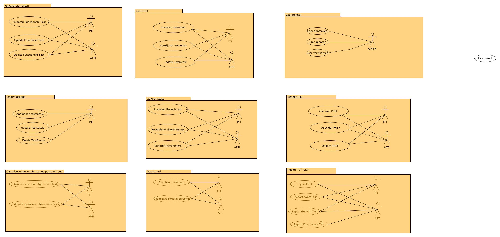

# 🪖 Project WARRIORFIT  
**Digitalisering van de Fysische Militaire Testen op niveau SOR-eenheid**

---

## 1. Titel van het project
**Digitalisering van de Fysische Militaire Testen op niveau SOR-eenheid**  
**Projectnaam:** WARRIORFIT

---

## 2. Aanleiding / Probleemstelling
Elke eenheid binnen Defensie beschikt over een **cel Fysieke Training**, met als doel militairen fysiek voor te bereiden op operationele inzet.  
Elke militair moet jaarlijks de **PHEF** (Physical Health Evaluation Form) afleggen.  
Daarnaast bestaan er bijkomende **functionele testen** voor gevechtseenheden, en voor de paracommando’s de **gevechtstesten**.

Het huidige beheer van deze testen verloopt grotendeels manueel, wat leidt tot:
- inefficiënt beheer van testresultaten,  
- beperkte opvolging van testmomenten,  
- en vertragingen in communicatie naar HRM.

---

## 3. Doelstelling
Het doel van dit project is het ontwikkelen van een **digitaal beheersysteem** voor de cel fysieke testen van een SOR-eenheid.  
Dit systeem moet:

- Het beheer van alle fysieke testen voor eigen personeel centraliseren.  
- Automatisch notificaties sturen via e-mail naar personeel voor aankomende testmomenten.  
- Automatisch testresultaten verzenden naar HRM.  
- Een duidelijk dashboard bieden over de fysieke toestand van de eenheid.

---

## 4. Scope

### Binnen scope
1. Beheer van gebruikers en toegangsrechten.  
2. Registreren en beheren van testsessies en testmomenten.  
3. Registreren en beheren van **PHEF-testen**.  
4. Registreren en beheren van **functionele testen**.  
5. Registreren en beheren van **gevechtstesten**.  
6. Analyse van testresultaten (geslaagd/gefaald).  
7. Opvolging van militairen die hun testen nog moeten afleggen.  
8. Beheer van de eenheid en subgroepen (“cross”).  
9. Automatische e-mailnotificaties van testresultaten.  
10. HRM-notificatie van uitgevoerde testen.  
11. Dashboard met de fysieke toestand van de eenheid.

### Buiten scope
- Integratie met andere Defensiebrede IT-systemen buiten HRM.  
- Mobiele applicatie (fase 2 mogelijk).  
- AI-gestuurde prestatieanalyse.

---

## 5. Resultaten (Deliverables)
**1. Analyse Dossier**
- User stories  
- Functionele en niet-functionele requirements  

**2. Werkende Webapplicatie**
- Front-end: Dashboard en beheermodules  
- Back-end: Database, API en mailingservice  
- Rapportagefunctie (export naar PDF / Excel)  
- HRM-integratie

---

## 6. Betrokkenen en Verantwoordelijkheden

| Rol              | Naam / Functie                      |
|------------------|-------------------------------------|
| **Projectleider** | Benoit I                            |
| **Opdrachtgever** | Hoofd Logistiek                     |
| **Gebruikers**    | Compagnie logistiek personeel        |
| **Ontwikkelaars** | IT-team / NGO-donoren               |

---

## 7. Planning (Globaal)
| Fase | Beschrijving | Deadline |
|------|---------------|----------|
| Analysefase | Opstellen van requirements en user stories | ULT |
| Ontwikkeling | Implementatie van de webapplicatie | ULT |
| Testfase | Functionele en gebruikersacceptatietesten | ULT |
| Oplevering | Productie en training gebruikers | ULT |

*(ULT = exacte datum nog te bepalen)*

---

## 8. Risico’s
- Gebrek aan betrouwbare data → gebruik van **fictieve datasets** in testfase.  
- Onvoldoende betrokkenheid gebruikers tijdens testfase.  
- Vertraagde communicatie met HRM.  
- Beperkte IT-ondersteuning op locatie.  

---

## 9. Technische Richtlijnen (optioneel)
- **Framework:** Python (FastAPI / Flask / Shiny for Python)  
- **Database:** PostgreSQL / SQLite (ontwikkelingsfase)  
- **Frontend:** HTML / Tailwind / Vue / Shiny UI  
- **Deployment:** Docker / lokale server  

---

## 10. Licentie
© 2025 – Project WARRIORFIT.  
Interne toepassing binnen Defensie – niet voor extern gebruik.

---
