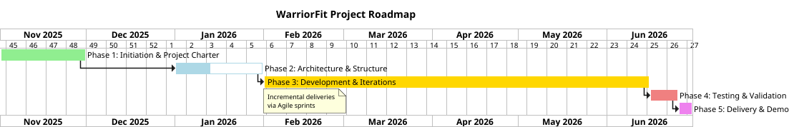

# 🛡️ WARRIORFIT

### Digitization of Physical Military Tests at SOR-Unit Level

**Author:** Benoit Goethals
**Academic Year:** 2025–2026

**Project Status:** In Progress

**Project Type:** Software Engineering

**Project Duration:** 6 months

**Project Language:** Python

## Project Description
WarriorFit is a comprehensive fitness and military management application designed to track physical performance, manage personnel data, and generate analytical reports. The system integrates data collection, statistical analysis, and reporting capabilities tailored for military fitness standards.
Each unit within Defence has a **physical training cell** aimed at preparing soldiers physically for operational deployment.
Annually, every soldier must complete the **PHEF** (Physical Fitness Evaluation Defence). In addition, combat units carry out **functional** and **combat tests**, while paracommandos must endure additional **combat evaluations**.
Currently, much of this process is manual, leading to inefficiency, errors, and administrative delays.

The system includes user management, test input, calculations, PDF reporting, and email distribution. It is designed for local server deployment within Defense.

## Project Goals
The main goals of this project are:
* To develop a comprehensive fitness  military management application
* To integrate data collection, statistical analysis, and reporting capabilities tailored for military fitness standards
* To integrate with existing Defence systems (HRM)

## Project Development Methodology
The project is developed using Agile methodology and SOLID principles.
Using Epic and User Stories, the project is divided into different Epic implementations. With as goal to deliver a working product at the end of each epic implementation.
The project is developed using Github.
The project is managed using Github.

## 1. Project Structure (click links)
The project documentation is structured in different documents:
1. * [Design](documentation/Design.md) (In Review)
2. * [Business Logic](documentation/business_logic.md) (In Review)
3. * [Datamodel/ERD](documentation/datamodel.md) (In Review)
4. * [Stories](documentation/stories.md) (In Review)
5. * [Initiale proposalInitiale proposal](documentation/project_proposel.md) (Done)
6. * [Module Structures](documentation/module_structure.md) (In Review)
7. * [MOM (broker)](documentation/broker.md) (In Development)
8. * [Install and deply](documentation/install.md) (In Development)
9. * [Retrospective](documentation/retrospective.md) 

if you want to see the project in action, you can check  :
 uvicorn ui.app:app --reload --log-level debug --host 0.0.0.0

## 2. Project Roadmap

### **Phase 1 — Initiation & Project Charter (Nov 2025)** (Done)

* Project scope and vision
* Initialize backlog and repository

### **Phase 2 — Architecture & Structure (Jan 2026)** (in Progress)

* Technical foundation, layer structure, and UML
* Working skeleton project

### **Phase 3 — Development & Iterations (Jan–Jun 2026)**

* Incremental deliveries via Agile sprints

### **Phase 4 — Testing & Validation (Jun 2026)**

* Acceptance testing and bug fixing

### **Phase 5 — Delivery & Demo (Jun 2026)**

* Final demo and handover to end users

## 3. Project Management
This project is managed by a team of 1 person.
Using Github project with Agile methodology.
On the kanban board, you can see the different tasks and their status.
https://github.com/users/BenoitGoethals/projects/20

