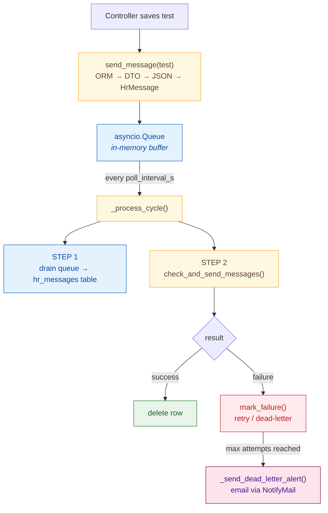

# Broker Service

The `Broker` class is the core component of the WarriorFit messaging middleware (`mom`). It reliably forwards fitness test results to the external HR system using the **transactional outbox pattern**: messages are persisted to the database before they are sent, so no data is lost on a crash or network failure.

## Overview

- **Location**: `warriorfit/mom/broker.py`
- **Pattern**: Transactional outbox with exponential back-off retry and dead-letter
- **Concurrency**: `asyncio` background task, non-blocking
- **Transport**: `BEMILService` (HTTP)

## Data Flow



## Supported Test Types

Each test type is converted to a dedicated DTO that extracts only the fields relevant to HR:

| ORM Model | DTO |
|---|---|
| `PhefTest` | `PhefTestDto` |
| `CombatTestParatrooper` | `CombatTestDto` |
| `CombatSwimmingTest` | `CombatSwimTestDto` |
| `March` | `MarchTestDto` |
| `FunctionalTest` | `FunctionalTestDto` |

## Retry and Dead-Letter

Failed sends are retried with **exponential back-off**:

```
next_retry_at = now + min(base_backoff_s × 2^attempt_count, max_backoff_s)
```

Once `attempt_count` reaches `max_attempts` the row is flipped to `dead_letter = true` and is never picked up again.

### hr_messages table

| Column | Description |
|---|---|
| `message` | JSON payload |
| `attempt_count` | Number of failed send attempts |
| `next_retry_at` | Earliest time the row may be retried |
| `dead_letter` | `true` once max attempts are exhausted |
| `last_error` | Reason string from the last failure |
| `datetime_created` | When the message was enqueued |

## Configuration Tunables

All values are read from `ApplicationConfig` at startup with safe defaults:

| Parameter | Default | Description |
|---|---|---|
| `broker_poll_interval_s` | `5` | Seconds between worker cycles |
| `broker_batch_size` | `5` | Max messages sent per cycle |
| `broker_max_attempts` | `10` | Attempts before dead-letter |
| `broker_base_backoff_s` | `5` | Minimum back-off (seconds) |
| `broker_max_backoff_s` | `600` | Maximum back-off (seconds) |
| `broker_alert_email` | `""` | Address that receives dead-letter alert emails (disabled when empty) |

## Key Methods

| Method | Description |
|---|---|
| `start() -> bool` | Creates the background asyncio task on the running event loop. **Self-healing**: if no loop is running yet (eager call at module-import time) it returns `False` without setting `running=True`, so a later call can succeed. Idempotent: re-calling when the worker is already alive is a no-op (warning logged). |
| `stop()` | Sets `running = False` and cancels the worker task |
| `send_message(test)` | Converts a `FitnessTest` (or `March`) to a DTO, wraps it in an `HrMessage`, puts it on the queue. **Lazy-starts the worker** when `_worker_task` is `None`/done — so even if the eager `Broker.start()` in `app.py` ran before the asyncio loop existed, the first `send_message()` brings the worker up. |
| `worker()` | Infinite loop: calls `_process_cycle()` every `poll_interval_s` seconds |
| `_process_cycle()` | Drains in-memory queue to DB, then calls `check_and_send_messages()` |
| `check_and_send_messages()` | Fetches a batch of due rows, sends to HR, deletes successes, records failures |
| `_try_send_to_hr(msg)` | Wraps `_send_message_to_hr` and returns a `(result, error_reason)` tuple |
| `_send_message_to_hr(msg)` | Calls `BEMILService.sent_hr_message_to_hr()` and handles transport exceptions |
| `_send_dead_letter_alert(message_id, attempts, last_error)` | Sends an HTML alert email via `NotifyMail` when a message is moved to dead-letter; no-ops when `broker_alert_email` is empty or `NotifyMail` is not wired |

## Dead-Letter Alerts

When a message exhausts `max_attempts` and is flipped to `dead_letter = true`, `_send_dead_letter_alert()` fires an HTML email to `broker_alert_email` containing:

- The failed `message_id` and the total attempt count.
- The `last_error` string recorded by `mark_failure()`.
- Remediation instructions (check HR connectivity; reset the row in `hr_messages` once the system is back).

The alert is best-effort: a failure to send the email is logged but does not affect broker operation.

## Why Two Stages?

The in-memory `asyncio.Queue` makes `send_message()` non-blocking for the caller. The database write in step 1 provides durability: if the app crashes between enqueue and send, the row survives in `hr_messages` and will be picked up on the next startup.

## Lifecycle (eager + lazy start)

`app.py` calls `_container.broker().start()` immediately after wiring the DI container:

```python
_container = Container()
...
_container.broker().start()  # eager start (best-effort)
```

Depending on the launcher (`shiny run`, `uvicorn`, test harness) the asyncio
event loop may or may not be running at that moment. The broker handles both
cases:

| Scenario | What `start()` does | What happens next |
|---|---|---|
| Loop already running | Creates `_worker_task` via `loop.create_task(self.worker())`, sets `running=True`, returns `True` | Worker runs every `poll_interval_s` |
| **No loop yet** (module-import path) | Catches the `RuntimeError`, logs a `WARNING`, leaves `running=False` and `_worker_task=None`, returns `False` | The first `await broker.send_message(test)` calls `self.start()` again — succeeds inside the loop and the worker launches |
| Already running | Logs a `WARNING` ("already running"), returns `True` | No-op |

The lazy-start path means **no message is ever lost just because the eager start ran before the loop**.

> Pre-2026-06-17 bug: the old `start()` set `running=True` *before* trying to grab the loop, so the `RuntimeError` short-circuit left the broker in a half-up state — `running=True` but `_worker_task=None` — and every later `start()` was rejected. Symptom: queue keeps growing, nothing ever reaches HR. Fix: `start()` no longer toggles `running` on failure, and `send_message()` calls `start()` lazily.

---

