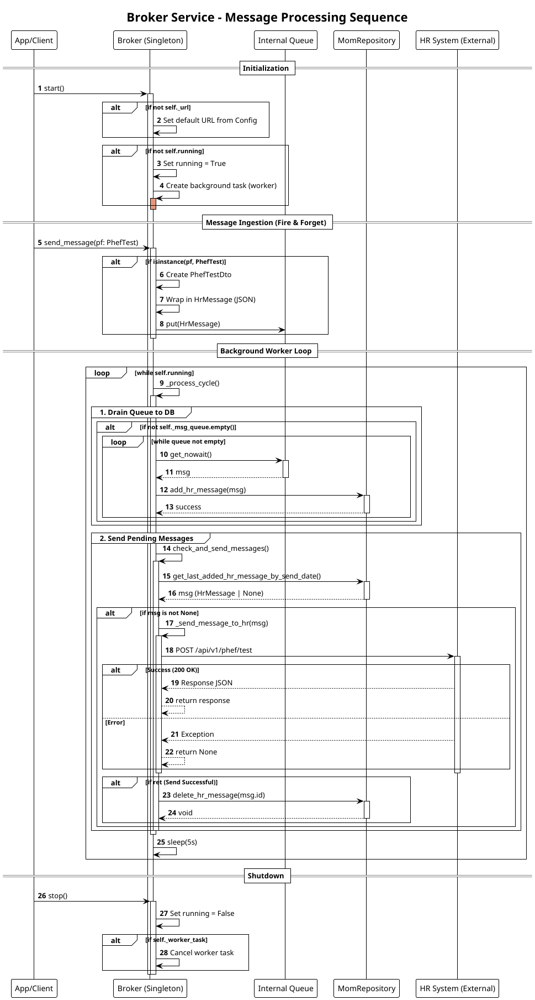

# Broker Service Documentation

The `Broker` class is a core component of the WarriorFit messaging system (`mom` - Message Oriented Middleware). It is responsible for asynchronously managing the transmission of fitness test results (`PhefTest`) to the external HR system.

## Overview

- **Location**: `warriorfit/mom/broker.py`
- **Pattern**: Singleton (Ensures only one broker instance runs).
- **Concurrency**: Uses `asyncio` for non-blocking background processing.
- **Network**: Uses `httpx` for HTTP requests.

## Architecture

The Broker acts as an intermediary that ensures data reliability:
1.  **In-Memory Queue**: Accepts incoming messages immediately into an `asyncio.Queue`.
2.  **Persistence**: Periodically moves messages from memory to the database (`MomRepository`) to prevent data loss.
3.  **Transmission**: Polls the database for pending messages and sends them to the configured HR endpoint.

## Key Methods

| Method | Description |
| :--- | :--- |
| `start()` | Initializes the background worker loop if not already running. Sets the API URL. |
| `stop()` | Cancels the background worker task and updates the running state. |
| `send_message(pf)` | Public entry point. Takes a `PhefTest` object, wraps it in a `PhefTestDto`, and puts it in the queue. |
| `worker()` | The main background loop. Runs every 5 seconds to trigger the processing cycle. |
| `_process_cycle()` | Orchestrates the flow: drains the memory queue to the DB, then checks for pending DB messages to send. |
| `check_and_send_messages()` | Retrieves the oldest pending message from the DB and attempts to send it via HTTP. |

---
