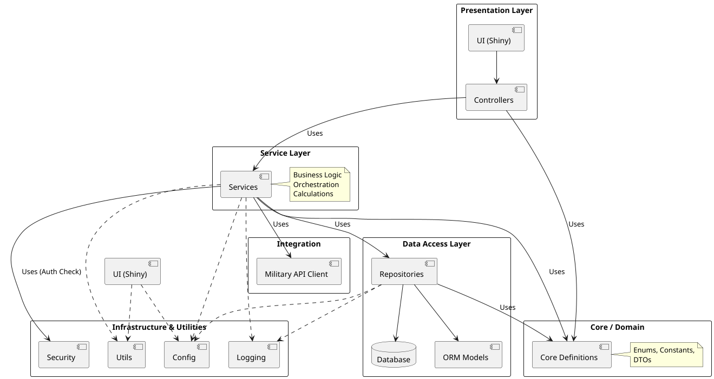

# WarriorFit - Module Structure

This document outlines the high-level module structure of the WarriorFit application. The project follows a **Layered Architecture** to ensure a clear separation of concerns, maintainability, and scalability.

## 1. High-Level Overview

The application is divided into the following primary layers:

1.  **Presentation Layer (`ui`)**: Handles user interactions, rendering, and input processing using Shiny for Python.
2.  **Service Layer (`services`)**: Contains business rules, orchestration, and core application logic.
3.  **Data Access Layer (`data`)**: Manages database interactions, repositories, and data models.
4.  **Core/Domain Layer (`core`)**: Shared definitions, enums, and data structures used across the application.
5.  **Infrastructure & Utilities**: Configuration, logging, security, and external integrations.

---

## 2. Module Breakdown

### 📂 `ui` (User Interface)
The frontend of the application, built with **Shiny for Python**. It is further organized into:

*   **`pages`**: Contains the layout and visual definitions for specific screens (e.g., Dashboard, Test Entry, Reporting).
*   **`controllers`**: Bridges the gap between the UI and the Service layer. Handles user events and updates the UI state.
*   **`app.py`**: The main entry point for the UI application, handling routing and initial setup.

### 📂 `services` (Business Logic)
The "brain" of the application. It implements the use cases defined in the project requirements.

*   **Management**: Services for managing users and military personnel (`military_service.py`, `service_user.py`).
*   **Fitness Logic**: Services specific to different test types (`service_test.py`, `service_cross.py`, `service_mars.py`).
*   **Reporting**: Logic for generating PDF and CSV reports (`report_generator_pdf.py`, `report_generator_csv.py`).
*   **Notifications**: Handles email distribution (`mail_service.py`).

### 📂 `data` (Data Access)
Handles all persistence-related operations.

*   **`db`**: Contains the SQLAlchemy ORM models (`db_model.py`) and the database connection logic.
*   **Repositories**: Implements the Repository Pattern to abstract database queries.
    *   `abc_repository.py`: Abstract base class for repositories.
    *   Specific repositories for entities (e.g., `user_repository.py`, `fitness_test_repository.py`).
*   **`scripts`**: Database migration scripts (Alembic).

### 📂 `core` (Domain Domain)
Stores the fundamental building blocks of the application domain.

*   **Enums**: Defines standard types like `Gender`, `Role`, `TypeFitnessTest` (`PHEF`, `COMBAT`, `FUNCTIONAL`, `SWIMMING`, `MFFT_EVAL`), `Cluster` (`COMBAT`, `ENABLER`, `OPS_SP`, `TER_SP`, `NON_DEP`), `MfftLevel` (`GOLD`, `SILVER`, `BRONZE`, `FIT`, `UNFIT`).
*   **Constants**: Application-wide constant values.
*   **DTOs (Data Transfer Objects)**: (Optional) Simple classes for passing data between layers without relying on ORM models.

### 📂 `config` (Configuration)
Manages application settings.

*   Loads configuration from `config.yml`.
*   Provides centralized access to settings like database URLs, SMTP credentials, and feature flags.

### 📂 `security` (Security)
Handles authentication and authorization.

*   **Authentication**: JWT (JSON Web Token) generation and validation.
*   **Hashing**: Password hashing utilities (using `bcrypt`).
*   **Access Control**: Helper functions to check user roles and permissions.

### 📂 `utils` (Utilities)
General-purpose helper functions.

*   Date/Time formatting.
*   Custom validation logic.
*   File handling helpers.

### 📂 `logs` (Logging)
*   Stores application log files.
*   Configuration for logging levels and formats.

---

## 3. Dependency Flow

The dependency flow is strictly **unidirectional** to prevent circular dependencies and maintain a clean architecture:

`UI` -> `Services` -> `Data` -> `Core`

*   The **UI** depends on **Services** to perform actions.
*   **Services** depend on **Repositories (Data)** to fetch/save data.
*   **Data** depends on **Core** for domain definitions.
*   **Core** has **no dependencies** on other application layers.
*   **Config** and **Utils** can be used by any layer as needed.
