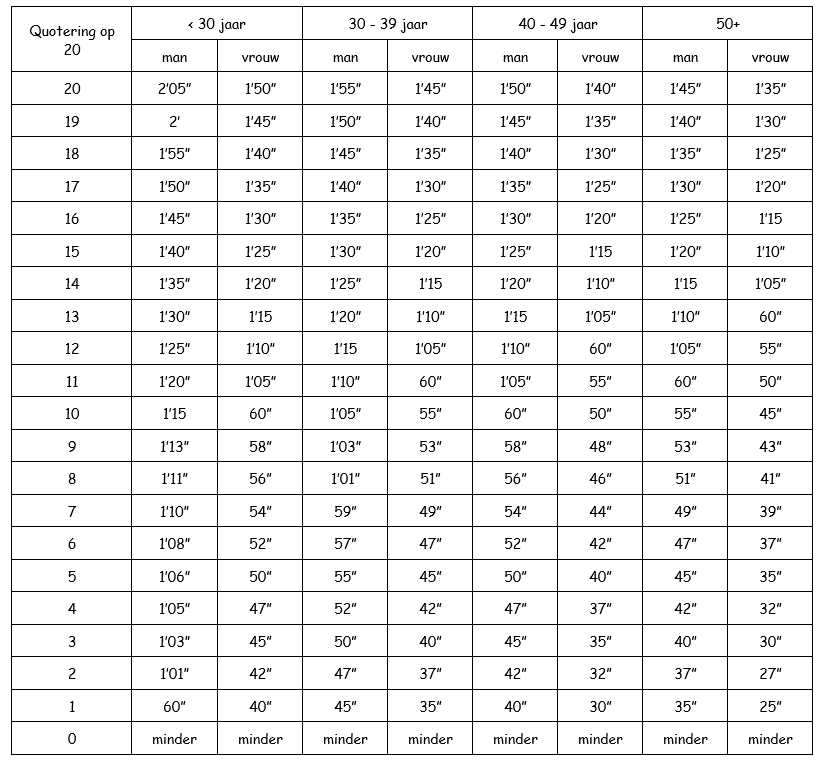
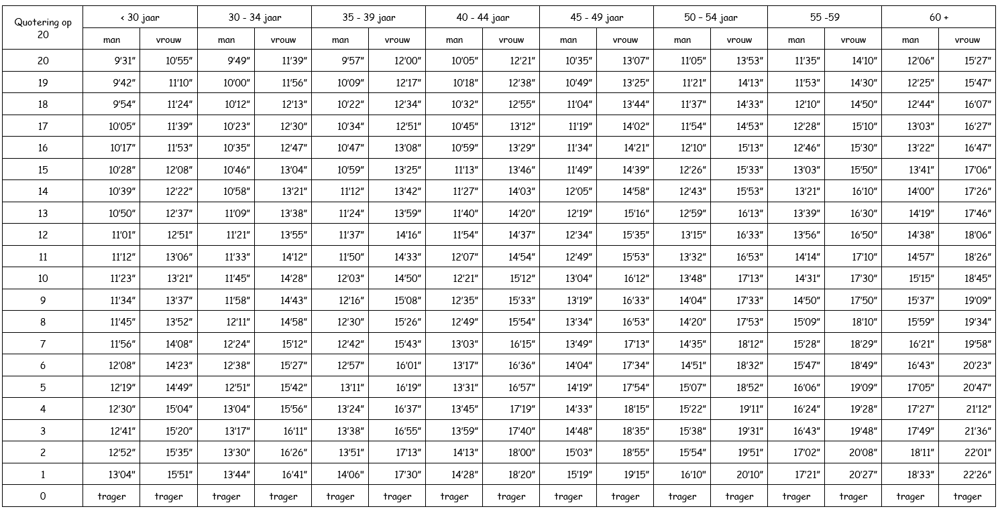

# 1. PHEF

The PHEF tests (Physical Fitness Evaluation Defence) form the standardized system within Defence to measure and monitor the physical readiness of military personnel. They serve as an objective evaluation of physical condition, strength, endurance, and functional suitability for operational deployment.

The tests ensure that every military member meets the minimum physical standards required to perform their duties in a safe, efficient, and sustainable manner, both in national and international operations.

All military personnel within Defence — regardless of rank, function, or component — are required to participate in the PHFED tests annually.

Depending on age, gender, and function category, specific norm tables and performance thresholds apply.

## a. Test Composition

According to the regulations, the PhEF consists of at least two fixed components:

1. *A core stability test*: the so-called "Left & Right Side Bridge" (side plank) — both sides are tested.
2. *A running test of 2400 meters*

## b. Calculation and Standards

Here is how the points and pass system works:

- Each test is scored on a maximum number of points. The compromise regulation states: side bridge left and right each 20 points. The 2400 m run is also worth 20 points.
- For the side bridge: the two sides are assessed separately (left and right), each with a maximum of 20 points, minimum 10/20 per side required to pass.
- The sum of the two side bridge scores is converted to 20 points
- Then the running test is scored on 20 points.
- The final score is the sum of both components: thus a maximum of 40 points
- To pass: minimum 50% of the points required in each part (thus at least 10/20 in the run and at least 10/20 in the converted side bridge part) according to older rules
- Additionally, there are badges:
  - *Gold badge*: 100% (40/40)
  - *Silver badge*: ≥ 90% (36-39/40)
  - *Bronze badge*: ≥ 80% (32-35/40)
- Norm tables are age and gender dependent. The age that counts is the age the military member reaches in the current calendar year
- In case of medical exemption, alternative tests may apply and the standards may be adjusted.
- See the following diagram for a visual representation of the calculation:

 
## c. Practical Matters & Points of Attention

- The test must be taken annually. Units must provide at least one test date per month so that military personnel have the opportunity.
- Prior to the test, the military member must be medically certified (occupational health approval).

---

# 2. Other Tests

## 1. Combat Tests

- *Speed March*: 16 km in 120min in combat uniform + weapon + webbing (3 kg)
- *Rope Course *
- *Obstacle Course*

For all separate tests you must achieve a GO.

## 2. Combat Swimming

- 100 m in combat uniform with weapon and boots
- *GO/NO GO*

## 3. Functional Tests

- Pull-ups
- Sit-ups
- Push-ups

For all separate tests you must achieve a GO.

### Pull-ups Points Table

### Men

| Points | 18-27 years | 28-37 years | 38-47 years | 48-56 years |
|--------|-------------|-------------|-------------|-------------|
| 10     | 20+         | 18+         | 16+         | 14+         |
| 9      | 18-19       | 16-17       | 14-15       | 12-13       |
| 8      | 16-17       | 14-15       | 12-13       | 10-11       |
| 7      | 14-15       | 12-13       | 10-11       | 8-9         |
| 6      | 12-13       | 10-11       | 8-9         | 6-7         |
| 5      | 10-11       | 8-9         | 6-7         | 5           |
| 4      | 8-9         | 6-7         | 5           | 4           |
| 3      | 6-7         | 5           | 4           | 3           |
| 2      | 4-5         | 3-4         | 2-3         | 2           |
| 1      | 1-3         | 1-2         | 1           | 1           |

### Women

| Points | 18-27 years | 28-37 years | 38-47 years | 48-56 years |
|--------|-------------|-------------|-------------|-------------|
| 10     | 12+         | 10+         | 8+          | 6+          |
| 9      | 10-11       | 8-9         | 6-7         | 5           |
| 8      | 8-9         | 6-7         | 5           | 4           |
| 7      | 6-7         | 5           | 4           | 3           |
| 6      | 5           | 4           | 3           | 2           |
| 5      | 4           | 3           | 2           | 2           |
| 4      | 3           | 2           | 2           | 1           |
| 3      | 2           | 2           | 1           | 1           |
| 2      | 1           | 1           | 1           | 1           |
| 1      | 0           | 0           | 0           | 0           |

---

## Push-ups Points Table

### Men

| Points | 18-27 years | 28-37 years | 38-47 years | 48-56 years |
|--------|-------------|-------------|-------------|-------------|
| 10     | 75+         | 65+         | 55+         | 45+         |
| 9      | 65-74       | 55-64       | 45-54       | 35-44       |
| 8      | 55-64       | 45-54       | 35-44       | 28-34       |
| 7      | 45-54       | 38-44       | 28-34       | 22-27       |
| 6      | 38-44       | 30-37       | 22-27       | 17-21       |
| 5      | 30-37       | 24-29       | 17-21       | 13-16       |
| 4      | 24-29       | 18-23       | 13-16       | 10-12       |
| 3      | 18-23       | 13-17       | 10-12       | 7-9         |
| 2      | 10-17       | 7-12        | 5-9         | 4-6         |
| 1      | 1-9         | 1-6         | 1-4         | 1-3         |

### Women

| Points | 18-27 years | 28-37 years | 38-47 years | 48-56 years |
|--------|-------------|-------------|-------------|-------------|
| 10     | 50+         | 42+         | 35+         | 28+         |
| 9      | 42-49       | 35-41       | 28-34       | 22-27       |
| 8      | 35-41       | 28-34       | 22-27       | 17-21       |
| 7      | 28-34       | 22-27       | 17-21       | 13-16       |
| 6      | 22-27       | 17-21       | 13-16       | 10-12       |
| 5      | 17-21       | 13-16       | 10-12       | 8-9         |
| 4      | 13-16       | 10-12       | 8-9         | 6-7         |
| 3      | 10-12       | 8-9         | 6-7         | 4-5         |
| 2      | 6-9         | 5-7         | 4-5         | 2-3         |
| 1      | 1-5         | 1-4         | 1-3         | 1           |

---

## Situps Points Table

### Men

| Punten | 18-27 jaar | 28-37 jaar | 38-47 jaar | 48-56 jaar |
|--------|------------|------------|------------|------------|
| 10     | 80+        | 70+        | 60+        | 50+        |
| 9      | 70-79      | 60-69      | 50-59      | 42-49      |
| 8      | 60-69      | 50-59      | 42-49      | 35-41      |
| 7      | 50-59      | 42-49      | 35-41      | 28-34      |
| 6      | 42-49      | 35-41      | 28-34      | 22-27      |
| 5      | 35-41      | 28-34      | 22-27      | 17-21      |
| 4      | 28-34      | 22-27      | 17-21      | 13-16      |
| 3      | 22-27      | 17-21      | 13-16      | 10-12      |
| 2      | 15-21      | 10-16      | 7-12       | 5-9        |
| 1      | 1-14       | 1-9        | 1-6        | 1-4        |

### Woman

| Punten | 18-27 jaar | 28-37 jaar | 38-47 jaar | 48-56 jaar |
|--------|------------|------------|------------|------------|
| 10     | 70+        | 60+        | 50+        | 40+        |
| 9      | 60-69      | 50-59      | 42-49      | 33-39      |
| 8      | 50-59      | 42-49      | 35-41      | 27-32      |
| 7      | 42-49      | 35-41      | 28-34      | 22-26      |
| 6      | 35-41      | 28-34      | 22-27      | 17-21      |
| 5      | 28-34      | 22-27      | 17-21      | 13-16      |
| 4      | 22-27      | 17-21      | 13-16      | 10-12      |
| 3      | 17-21      | 13-16      | 10-12      | 7-9        |
| 2      | 10-16      | 7-12       | 5-9        | 4-6        |
| 1      | 1-9        | 1-6        | 1-4        | 1-3        |

---

# 3. Eval MFFT (Military Functional Fitness Test)

The Eval MFFT is the Land Component's new annual functional fitness assessment
(rolled out in 2026). Every event mirrors a task a soldier may have to
execute in the field.

## a. Composition — 3 blocks, 8 events

| # | Block | Event | Unit |
|---|-------|-------|------|
| 1 | EMOM 6 min | Pull-up | reps |
| 2 | EMOM 6 min | Burpees step-over | reps |
| 3 | EMOM 6 min | Kettlebell farmer walk | meters |
| 4 | EMOM 6 min | Hand & release push-up | reps |
| 5 | EMOM 6 min | Casualty drag | meters |
| 6 | EMOM 6 min | Sandbag shoulder carry | meters |
| 7 | Combat Run | 4 800 m speed-march, timed | seconds |
| 8 | Combat Swim | 200 m uninterrupted swim + 2 m dive, timed | seconds |

## b. Cluster classification (project rule)

| `para` flag | Cluster | Scoring scale |
|---|---|---|
| `True` (paratroopers) | `COMBAT` | 4-tier scale (GOLD / SILVER / BRONZE / FIT) |
| `False` (everyone else) | `ENABLER` | Single age-bracketed pass threshold |

`ServiceMen.cluster` is a derived `@property`, not a column.

## c. Scoring rules

- **COMBAT**: a tier is validated when ≥ 6 of 8 events reach it AND no event
  is UNFIT.
- **ENABLER**: every event must meet the single age-bracketed threshold;
  any miss is UNFIT.
- **Invariant**: `passed ⇔ overall != UNFIT` for every cluster.

See `warriorfit/logic/mfft_eval_calculator.py` for the official thresholds.
