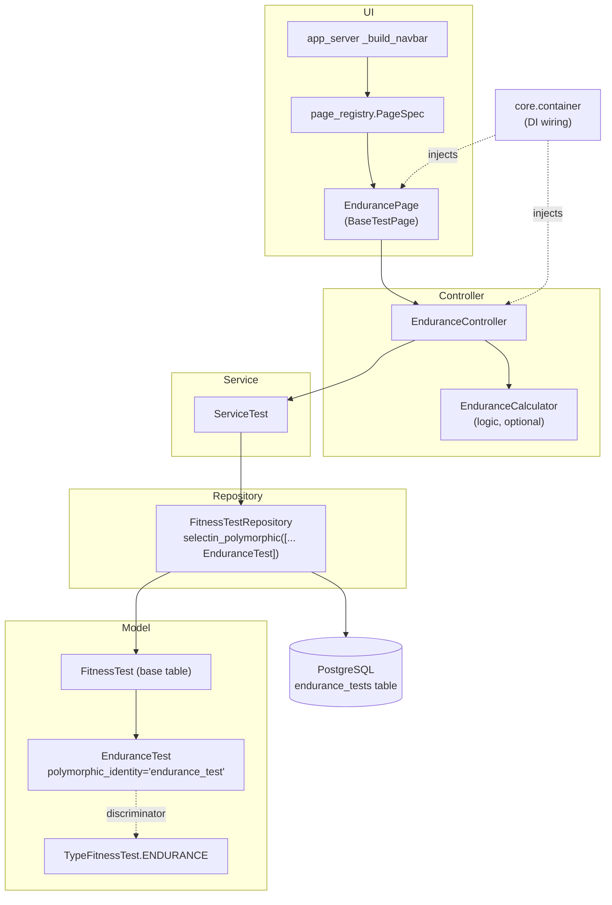
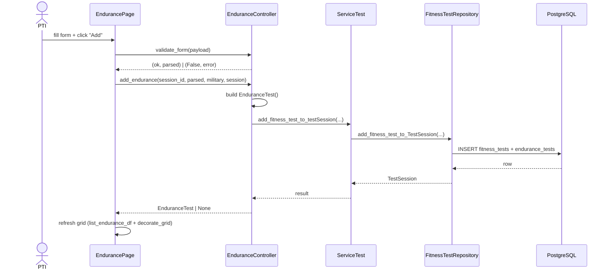

# Adding a New Fitness Test Type

This guide explains, step by step, how to introduce a **new physical test type**
(e.g. a hypothetical *Endurance Test*) into WarriorFit.

Fitness tests use SQLAlchemy **single-table-per-subclass polymorphism**: a base
`FitnessTest` row plus a child row in a type-specific table, joined on a shared `id`.
Because the platform is strictly layered, a new test type must be threaded through
**every layer** — from the ORM model up to the navbar and translation catalogs.

Use the existing **PHEF** test as the reference implementation; almost every file you
touch already has a PHEF sibling to copy.

---

## 1. The layers you touch

```
                         ┌───────────────────────────────────────────────┐
                         │  New "Endurance" test type — files to change    │
                         └───────────────────────────────────────────────┘

 ① ORM model        warriorfit/data/model/db_model.py        ← new EnduranceTest(FitnessTest)
 ② Enum             warriorfit/core/type_fitness_test.py     ← TypeFitnessTest.ENDURANCE
 ③ Migration        alembic/versions/xxxx_add_endurance.py   ← create endurance_tests table
 ④ (opt) Logic      warriorfit/logic/endurance_calculator.py ← scoring rules
 ⑤ Repository       warriorfit/data/repositories/
                        fitness_test_repository.py            ← polymorphic lists + getter
 ⑥ Service          warriorfit/services/service_test.py       ← passthrough query/command
 ⑦ Controller       warriorfit/ui/controllers/
                        endurance_controller.py               ← validation + grid + commands
 ⑧ Page             warriorfit/ui/pages/endurance_test.py     ← BaseTestPage subclass + _page
 ⑨ Page registry    warriorfit/ui/page_registry.py            ← PageSpec(...) entry
 ⑩ DI container     warriorfit/core/container.py              ← provider + wiring module
 ⑪ i18n             warriorfit/i18n/translations/{en,nl,fr}.json ← nav.* + endurance.* keys
 ⑫ Tests            tests/                                    ← calculator + controller tests
```

### Dependency flow (where a new type plugs in)



### End-to-end "add a result" sequence



---

## 2. Step-by-step

### ① ORM model — `warriorfit/data/model/db_model.py`

Add a subclass of `FitnessTest`. Each subtype is its own table, primary-keyed by a FK
back to `fitness_tests.id`, and declares a unique `polymorphic_identity`.

```python
class EnduranceTest(FitnessTest):
    __tablename__ = "endurance_tests"

    id: Mapped[int] = mapped_column(ForeignKey("fitness_tests.id"), primary_key=True)
    distance_m: Mapped[int] = mapped_column(nullable=False)
    duration_s: Mapped[float] = mapped_column(Float, nullable=False)

    __mapper_args__ = {"polymorphic_identity": "endurance_test"}

    def __repr__(self) -> str:
        return f"<EnduranceTest(id={self.id}, distance_m={self.distance_m})>"
```

> The base `FitnessTest` already defines `serial_number`, the `type` discriminator
> column and the `service_men` relationship — your subclass only adds its own columns.

### ② Enum — `warriorfit/core/type_fitness_test.py`

`TypeFitnessTest` is the **logical** test family stored on `TestSession.type_test`
(distinct from the ORM `polymorphic_identity` string). Add a member:

```python
class TypeFitnessTest(Enum):
    PHEF = ("PHEF",)
    COMBAT = ("COMBAT",)
    FUNCTIONAL = "FUNCTIONAL"
    SWIMMING = "SWIMMING"
    ENDURANCE = "ENDURANCE"   # ← new
```

### ③ Alembic migration

Generate and apply a migration for the new table:

```bash
.venv/bin/alembic revision --autogenerate -m "add endurance_tests"
.venv/bin/alembic upgrade head
```

Review the autogenerated file — confirm it creates `endurance_tests` with the
`id` FK to `fitness_tests.id` and `ondelete` matching the other test tables.

### ④ (Optional) Scoring logic — `warriorfit/logic/endurance_calculator.py`

If the type needs scoring/grading (like `PhefCalculator`), put **pure, stateless**
calculation here. Keep it free of DB/UI concerns so it is trivially unit-testable.

```python
class EnduranceCalculator:
    @staticmethod
    def score(distance_m: int, duration_s: float, age: int, gender) -> int:
        ...
```

### ⑤ Repository — `warriorfit/data/repositories/fitness_test_repository.py`

Two things:

**(a)** Add `EnduranceTest` to **every** `selectin_polymorphic([...])` / `selectinload`
list so the new subtype's columns are eagerly loaded with the base rows. Search the
file for `PhefTest,` — each occurrence in a polymorphic options list needs the new class:

```python
selectin_polymorphic(
    FitnessTest,
    [PhefTest, FunctionalTest, CombatTestParatrooper, CombatSwimmingTest, EnduranceTest],
)
```

**(b)** Add a type-specific getter, mirroring `get_all_phef` / `get_all_combat_test`:

```python
async def get_all_endurance(self, session_id: int, current_year=True) -> list[EnduranceTest]:
    async with self.SessionLocal() as session, session.begin():
        ...  # copy get_all_phef, filter isinstance(test, EnduranceTest)
```

Don't forget the import at the top of the file.

### ⑥ Service — `warriorfit/services/service_test.py`

`ServiceTest` is the thin orchestration layer the controllers call. Add a passthrough:

```python
async def get_all_endurance(self, id):
    return await self._test_repo.get_all_endurance(id, self._config.current_year)
```

Adding (`add_fitness_test_to_testSession`), updating (`update_fitness_test`) and
deleting (`delete_fitness_test_from_test_session`) are **generic** over `FitnessTest`,
so they already work for the new subtype — no changes needed there. Add a
`build_email_body_endurance(...)` only if you send result emails for this type.

### ⑦ Controller — `warriorfit/ui/controllers/endurance_controller.py`

Copy `phef_controller.py`. A controller owns:

- **`validate_form(data)`** → `(ok, parsed | error_msg)`
- **`load_sessions()`** → `service.get_all_test_sessions_type_fitness_test(TypeFitnessTest.ENDURANCE)`
- **`search_military(serial)`**, **`get_session_by_id(id)`**
- **`list_endurance_df(session_id)`** → build the results `pd.DataFrame` (calling the calculator)
- **`decorate_grid(df)`** → 🟥/🟩 pass/fail markers
- **`add_endurance(...)`, `update_endurance(...)`, `delete_endurance(...)`** → build the
  `EnduranceTest` and delegate to `ServiceTest`

```python
async def add_endurance(self, session_id, payload, military, session) -> EnduranceTest | None:
    e = EnduranceTest()
    e.test_session_id = int(session_id)   # type: ignore[attr-defined]
    e.serial_number = payload["serialnr"]
    e.distance_m = payload["distance_m"]
    e.duration_s = payload["duration_s"]
    return await self._service.add_fitness_test_to_testSession(int(session_id), e, military, session)
```

### ⑧ Page — `warriorfit/ui/pages/endurance_test.py`

Copy `phef.py`. Subclass `BaseTestPage` (it provides session selection, military
search, button/disable helpers — see `base_test_page.py`) and implement the abstract
methods `get_prefix()`, `get_tab_name()`, `_clear_form_hook()`.

Use a **unique input-ID prefix** (PHEF uses `ph`); e.g. `en` here. End the module with
the standard lazy `_page` pattern so the page is instantiated once, on first use:

```python
class EndurancePage(BaseTestPage):
    @inject
    def __init__(self, controller: EnduranceController = Provide[Container.endurance_controller]):
        super().__init__()
        self.controller = controller

    def get_prefix(self) -> str:
        return "en"

    def get_tab_name(self) -> str:
        return "Endurance Tests"

    def get_ui(self) -> NavPanel:
        return ui.nav_panel(t("nav.endurance_tests"), ui.h2(t("endurance.title")), ...)

    async def _clear_form_hook(self, input, session) -> None:
        ...

_page = None
def _get_page():
    global _page
    if _page is None:
        _page = EndurancePage()
    return _page

def get_ui() -> NavPanel:
    return _get_page().get_ui()

def server(input, output, session) -> None:
    _get_page().server(input, output, session)
```

> All user-facing strings go through `t("...")`. See
> [i18n.md](../docs/i18n.md) for how the translation layer works.

### ⑨ Page registry — `warriorfit/ui/page_registry.py`

This is the **single source of truth** for which pages exist and who may see them
(RBAC). Import the module in `get_pages()` and add a `PageSpec`:

```python
from warriorfit.ui.pages import (..., endurance_test)

PageSpec(
    tab="Endurance Tests",
    group="Physical Tests",            # places it under the "Physical Tests" nav menu
    ui_factory=endurance_test.get_ui,
    server_factory=endurance_test.server,
    allowed_roles={Role.ADMIN, Role.PTI, Role.APTI},
),
```

The navbar (`app_server._build_navbar`) builds itself from these specs, so **no navbar
code changes are required** — visibility is controlled entirely by `allowed_roles`.

### ⑩ DI container — `warriorfit/core/container.py`

Two edits:

**(a)** Register the controller as a singleton provider (near `phef_controller`):

```python
from warriorfit.ui.controllers.endurance_controller import EnduranceController

endurance_controller = providers.Singleton(
    EnduranceController, service=test_service, mil_service=military_service
)
```

**(b)** Add the page module to `wiring_config.modules` so `@inject` / `Provide[...]`
resolves inside the page:

```python
wiring_config = containers.WiringConfiguration(
    modules=[
        ...
        "warriorfit.ui.pages.endurance_test",   # ← new
    ]
)
```

### ⑪ Translations — `warriorfit/i18n/translations/{en,nl,fr}.json`

Add the **same keys to all three** files (EN is the fallback). At minimum a nav label
and the page strings:

```jsonc
// en.json
"nav.endurance_tests": "Endurance Tests",
"endurance.title": "Endurance Test",
"endurance.distance": "Distance (m)",
"endurance.duration": "Duration (mm:ss)"
```

> Keep the three files key-synchronized — a missing key silently falls back to English.
> See [i18n.md](../docs/i18n.md).

### ⑫ Tests — `tests/`

- Unit-test the calculator (`tests/test_endurance_calculator.py`) — pure functions, no DB.
- Test the controller's `validate_form` and add/update/delete with a mocked service.
- Follow the existing **singleton-isolation** fixture pattern (clear
  `Singleton._instances`) noted in `CLAUDE.md`.

```bash
pytest tests/ -v
ruff check warriorfit/
mypy warriorfit/
```

---

## 3. Checklist

- [ ] `EnduranceTest` model + unique `polymorphic_identity`
- [ ] `TypeFitnessTest.ENDURANCE` enum member
- [ ] Alembic migration generated **and** applied
- [ ] (opt) `EnduranceCalculator` scoring logic
- [ ] Added to **all** `selectin_polymorphic` lists + new repo getter
- [ ] `ServiceTest` passthrough query
- [ ] `EnduranceController` (validate / grid / commands)
- [ ] `EndurancePage` with unique input prefix + `_page` lazy pattern
- [ ] `PageSpec` in `page_registry.py` with `allowed_roles`
- [ ] DI: `endurance_controller` provider **and** wiring module entry
- [ ] EN/NL/FR translation keys (synchronized)
- [ ] Tests + `ruff` + `mypy` green

---

## 4. Why so many layers?

The strict, unidirectional dependency flow (`UI → Controller → Service → Repository →
Model`) is what keeps WarriorFit testable and the polymorphic test model extensible.
Each layer has one job, so a new type is *additive* — you copy a known-good sibling at
every layer rather than modifying shared logic. The only genuinely shared touch-points
are the **polymorphic loader lists** in the repository and the **enum**; everything else
is a new file plus a registration entry.

See also: [ARCHITECTURE.md](ARCHITECTURE.md), [PHEF_DATA_FLOW.md](PHEF_DATA_FLOW.md),
[DI_USAGE_GUIDE.md](DI_USAGE_GUIDE.md).
