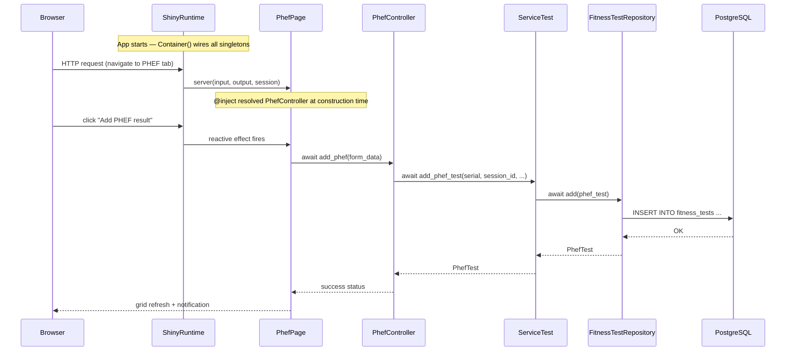

# Dependency Injection Usage Guide

## 1. What is Dependency Injection?

Without DI, every class creates its own dependencies:

```python
# ❌ Without DI — tight coupling, hard to test
class PhefController:
    def __init__(self):
        self._service = ServiceTest()          # creates its own ServiceTest
        self._service._test_repo = FitnessTestRepository()  # which creates its own repo
        self._service._config = ApplicationConfig()          # which reads config itself
```

With DI, dependencies are **supplied from outside**:

```python
# ✅ With DI — loose coupling, easy to test or swap
class PhefController:
    def __init__(
        self,
        service: ServiceTest = None,
        mil_service: MilitaryService = None,
    ) -> None:
        self._service = service
        self.be_mil_service = mil_service
```

The `Container` is the single place that **wires everything together**.

---

## 2. Architecture Overview

WarriorFit follows a strict unidirectional dependency flow:

```
Browser Request
      │
      ▼
┌─────────────────────┐
│   Shiny Page        │  phef.py, sessions.py, ...
│   (@inject)         │  receives controller via Provide[Container.xxx]
└────────┬────────────┘
         │ uses
         ▼
┌─────────────────────┐
│   Controller        │  PhefController, SessionsController, ...
│                     │  orchestrates UI ↔ service calls
└────────┬────────────┘
         │ uses
         ▼
┌─────────────────────┐
│   Service           │  ServiceTest, ServiceCross, MilitaryService, ...
│                     │  business logic, validation, email
└────────┬────────────┘
         │ uses
         ▼
┌─────────────────────┐
│   Repository        │  FitnessTestRepository, CrossRepository, ...
│   (async)           │  SQL queries via SQLAlchemy AsyncSession
└────────┬────────────┘
         │ uses
         ▼
┌─────────────────────┐
│   ORM Models        │  PhefTest, TestSession, ServiceMen, ...
│   (PostgreSQL)      │  db_model.py — polymorphic FitnessTest
└─────────────────────┘
         ▲
         │ configured by
┌─────────────────────┐
│ ApplicationConfig   │  reads config_dev.yml / /etc/WarriorFit/config.yml
└─────────────────────┘
```

---

## 3. Container Dependency Graph

The `Container` in `warriorfit/core/container.py` defines every singleton and its wiring.  
Read the arrows as "**needs**":

```mermaid
flowchart TD
    config["⚙️ ApplicationConfig\n(Singleton)"]

    subgraph Repositories
        ur[UserRepository]
        sr[ServicemenRepository]
        ftr[FitnessTestRepository]
        cr[CrossRepository]
        mr[MarchRepository]
        rr[ReservationRepository]
        mom[MomRepository]
        conr[ConsentRepository]
    end

    subgraph ExternalServices
        bemil[BEMILService]
        mil[MilitaryService]
        mail[MailService]
        notify[NotifyMail]
    end

    subgraph Services
        us[UserService]
        ts[ServiceTest]
        xs[ServiceCross]
        ms[ServiceMarch]
        rfrs[ReserveFitnessRoomService]
        cs[ConsentService]
        gs[GdprService]
        ret[RetentionService]
        dc[DataCollector]
        rpdf[ReportGeneratorPdf]
        rcsv[ReportGeneratorCsv]
        broker[Broker]
    end

    subgraph Controllers
        phef_c[PhefController]
        sess_c[SessionsController]
        cross_c[CrossController]
        own_c[OwnUnitController]
        priv_c[PrivacyController]
    end

    config --> ur & sr & ftr & cr & mr & rr & mom & conr
    config --> bemil & mail
    config --> us & ts & xs & ms & rfrs & cs & gs & ret & dc & rpdf & rcsv & broker

    bemil --> mil
    sr --> mil

    ur --> us
    ftr & ur --> ts
    notify --> ts

    cr & ur & mil --> xs
    mr & ur & mil & notify --> ms
    rr & sr & ur & notify --> rfrs
    conr & ur --> cs
    ur & sr & ftr & mr & conr --> gs
    ur --> ret

    ts & ms & mil --> dc
    xs & mil & ts --> rpdf
    mil & ts --> rcsv
    mom & bemil --> broker
    mail --> notify

    ts & mil --> phef_c
    ts & mil & mail --> sess_c
    xs & mil & rpdf --> cross_c
    mil & dc & ts & ms & rpdf --> own_c
    gs & cs --> priv_c

    classDef cfg    fill:#e3f2fd,stroke:#1565c0,color:#0d47a1
    classDef repo   fill:#fff3e0,stroke:#ef6c00,color:#e65100
    classDef svc    fill:#e0f7fa,stroke:#00838f,color:#006064
    classDef ctrl   fill:#f3e5f5,stroke:#7b1fa2,color:#4a148c
    classDef ext    fill:#e8f5e9,stroke:#2e7d32,color:#1b5e20

    class config cfg
    class ur,sr,ftr,cr,mr,rr,mom,conr repo
    class us,ts,xs,ms,rfrs,cs,gs,ret,dc,rpdf,rcsv,broker svc
    class phef_c,sess_c,cross_c,own_c,priv_c ctrl
    class bemil,mil,mail,notify ext
```



---

## 4. Provider Types

The container uses two `dependency-injector` provider types:

| Provider | Meaning | Used for |
|---|---|---|
| `providers.Singleton` | Created once, shared everywhere | All repositories, services, controllers, config |
| `providers.Factory` | New instance on every call | Not used in WarriorFit — everything is singleton |

```python
# warriorfit/core/container.py

class Container(containers.DeclarativeContainer):

    # 1 — Config is the root singleton
    config = providers.Singleton(ApplicationConfig)

    # 2 — Repositories receive config
    fitness_test_repository = providers.Singleton(
        FitnessTestRepository,
        config=config,           # ← injected by name
    )
    user_repository = providers.Singleton(
        UserRepository,
        config=config,
    )

    # 3 — Services receive repositories and config
    test_service = providers.Singleton(
        ServiceTest,
        fitness_test_repository=fitness_test_repository,
        user_repository=user_repository,
        config=config,
        notify_mail=notify_mail,
    )

    # 4 — Controllers receive services
    phef_controller = providers.Singleton(
        PhefController,
        service=test_service,
        mil_service=military_service,
    )
```

---

## 5. Wiring: How Pages Receive Their Controller

The container's `wiring_config` tells `dependency-injector` **which modules** to scan for `@inject` decorators:

```python
wiring_config = containers.WiringConfiguration(
    modules=[
        "warriorfit.ui.app_server",
        "warriorfit.ui.pages.phef",
        "warriorfit.ui.pages.sessions",
        # ... all 25 page modules
    ]
)
```

When `Container()` is created in `app.py`, the framework patches every listed module so that `Provide[Container.xxx]` resolves to the live singleton.

---

## 6. Real Code Examples

### 6.1 Page — receives controller via `@inject`

**File:** `warriorfit/ui/pages/phef.py`

```python
from dependency_injector.wiring import Provide, inject
from warriorfit.core.container import Container
from warriorfit.ui.controllers.phef_controller import PhefController

class PhefPage(BaseTestPage):

    @inject                                                      # ← marks constructor for wiring
    def __init__(
        self,
        controller: PhefController = Provide[Container.phef_controller]  # ← resolved by container
    ) -> None:
        super().__init__()
        self.controller = controller   # already-built singleton, no manual wiring
```

`Provide[Container.phef_controller]` is the **default** value. At runtime the container replaces it with the real `PhefController` singleton. In tests you can pass a mock directly instead.

---

### 6.2 Function — receives services via `@inject`

**File:** `warriorfit/ui/app_server.py`

```python
from dependency_injector.wiring import Provide, inject
from warriorfit.core.container import Container

@inject                                                          # ← function-level injection
def make_server(
    user_service: UserService = Provide[Container.user_service],
    servicemen_repository: ServicemenRepository = Provide[Container.servicemen_repository],
    config: ApplicationConfig = Provide[Container.config],
):
    # user_service, servicemen_repository, config are injected — no manual instantiation
    def server(input, output, session):
        ...
    return server
```

---

### 6.3 Controller — receives services via constructor

**File:** `warriorfit/ui/controllers/phef_controller.py`

```python
class PhefController:
    """Orchestrates PHEF page: validation, DB queries, grid decoration."""

    def __init__(
        self,
        service: ServiceTest = None,         # supplied by Container
        mil_service: MilitaryService = None, # supplied by Container
    ) -> None:
        self._service = service if service is not None else ServiceTest()
        self.be_mil_service = mil_service if mil_service is not None else MilitaryService()
```

The `if … is not None else …` fallback is a **backward-compatibility guard** — it lets the controller still work if instantiated directly (e.g. in older tests), but normally the container always supplies the arguments.

---

### 6.4 Service — receives repository via constructor

**File:** `warriorfit/services/service_test.py`

```python
class ServiceTest(Service):

    def __init__(
        self,
        fitness_test_repository: FitnessTestRepository = None,
        user_repository=None,
        config=None,
        notify_mail=None,
    ):
        super().__init__(user_repository=user_repository, config=config)
        self._test_repo = (
            fitness_test_repository
            if fitness_test_repository is not None
            else FitnessTestRepository()   # fallback only if no DI
        )
        self._notify_mail = notify_mail
```

---

### 6.5 Repository — receives config via constructor

**File:** `warriorfit/data/repositories/fitness_test_repository.py` (representative)

```python
class FitnessTestRepository(ABCRepository):

    def __init__(self, config: ApplicationConfig = None) -> None:
        super().__init__(config=config)
        # config.db_url used in ABCRepository to build async_sessionmaker
```

---

## 7. Full Request Flow (Sequence Diagram)



---

## 8. Container Initialisation in `app.py`

```python
# warriorfit/app.py  (simplified)

from warriorfit.core.container import Container

container = Container()      # wires ALL modules listed in wiring_config
container.wire(modules=[...])

broker = container.broker()  # get the singleton Broker
asyncio.get_event_loop().run_until_complete(broker.start())

app = App(build_app_ui(), make_server())
```

The container is created **once** at startup. Every `Singleton` is lazily instantiated the first time it is accessed and then reused for the lifetime of the process.

---

## 9. Adding a New Component

Suppose you add `FooService` that depends on `UserRepository` and `config`.

**Step 1 — Write the class with constructor injection:**

```python
# warriorfit/services/foo_service.py
class FooService(Service):
    def __init__(self, user_repository=None, config=None):
        super().__init__(user_repository=user_repository, config=config)
```

**Step 2 — Register it in the container:**

```python
# warriorfit/core/container.py
foo_service = providers.Singleton(
    FooService,
    user_repository=user_repository,   # existing provider
    config=config,                     # existing provider
)
```

**Step 3 — Wire a controller that uses it:**

```python
foo_controller = providers.Singleton(
    FooController,
    service=foo_service,
)
```

**Step 4 — Inject into the page:**

```python
# warriorfit/ui/pages/foo.py
class FooPage:
    @inject
    def __init__(
        self,
        controller: FooController = Provide[Container.foo_controller]
    ) -> None:
        self.controller = controller
```

**Step 5 — Add the page module to `wiring_config`:**

```python
wiring_config = containers.WiringConfiguration(
    modules=[
        ...
        "warriorfit.ui.pages.foo",   # ← add this line
    ]
)
```

---

## 10. Testing with DI

Because every dependency is injected, tests can override any layer with a mock — no monkey-patching required.

```python
# tests/test_phef_controller.py
import pytest
from unittest.mock import AsyncMock, MagicMock
from warriorfit.ui.controllers.phef_controller import PhefController

@pytest.fixture
def controller():
    mock_service = MagicMock()
    mock_service.load_phef_sessions = AsyncMock(return_value=[])
    mock_service.add_phef_test = AsyncMock(return_value=None)

    mock_mil = MagicMock()
    mock_mil.get_by_serial = AsyncMock(return_value=None)

    # Pass mocks directly — no container needed
    return PhefController(service=mock_service, mil_service=mock_mil)

@pytest.mark.asyncio
async def test_load_sessions_returns_empty(controller):
    result = await controller.load_sessions()
    assert result == []
```

### Container-level override (integration tests)

```python
from warriorfit.core.container import Container

def test_with_container_override():
    container = Container()
    container.user_repository.override(MockUserRepository())

    # All services that depend on user_repository now get the mock
    us = container.user_service()
    # ... test us
    container.user_repository.reset_override()
```

> **Important:** Always call `reset_override()` or use `container.user_repository.override(mock)` as a context manager to avoid leaking state between tests.

---

## 11. Quick Reference

| Task | What to do |
|---|---|
| Get a service in a page | `@inject` + `Provide[Container.xxx_controller]` in `__init__` |
| Get a service in a function | `@inject` + `Provide[Container.xxx]` as default parameter |
| Add a new service | Register `providers.Singleton(...)` in `container.py` |
| Add a new page | Register in `container.py`, add module to `wiring_config`, add `PageSpec` in `page_registry.py` |
| Mock a dependency in tests | Pass the mock directly to the constructor; no container needed |
| Mock via container | `container.xxx.override(mock)` + `reset_override()` |
| Check what is wired | Read `Container.wiring_config.modules` in `container.py` |
| Singleton lifetime | Process lifetime — one instance per `Container()` call |
