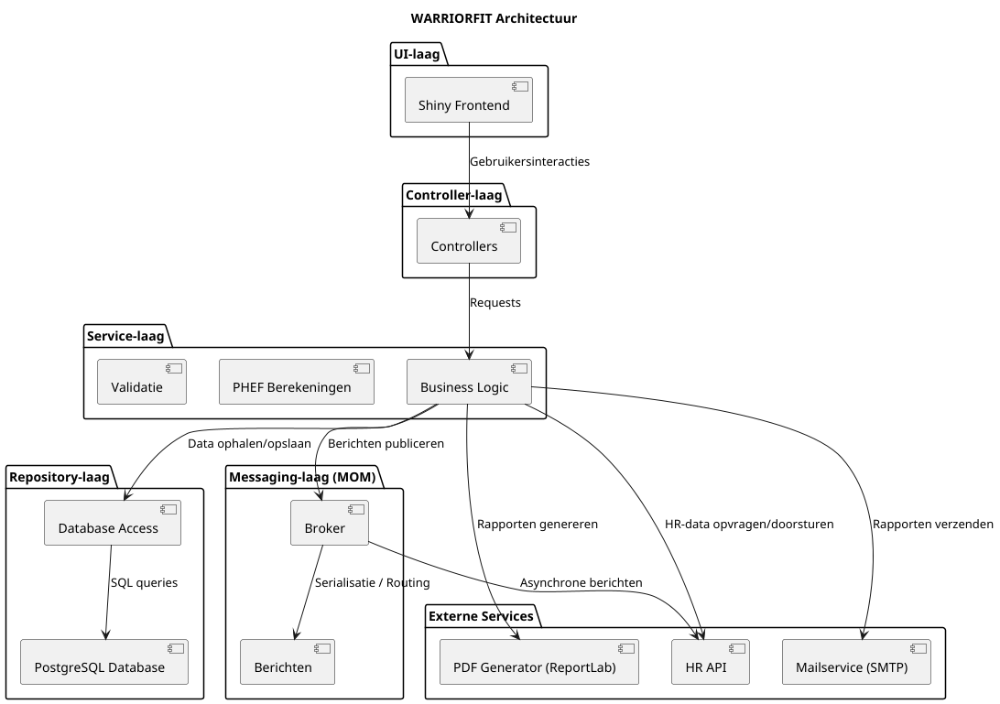

# WarriorFit Design Document

## 1. Project Overview
WarriorFit is a comprehensive fitness and military management application designed to track physical performance, manage personnel data, and generate analytical reports. The system integrates data collection, statistical analysis, and reporting capabilities tailored for military fitness standards.
Each unit within Defence has a **physical training cell** aimed at preparing soldiers physically for operational deployment.
Annually, every soldier must complete the **PHEF** (Physical Fitness Evaluation Defence). In addition, combat units carry out **functional** and **combat tests**, while paracommandos must endure additional **combat evaluations**.

Currently, much of this process is manual, leading to inefficiency, errors, and administrative delays.

### Purpose

This document serves as a guideline for developers during the implementation of WARRIORFIT.

### Scope

The system includes user management, test input, calculations, PDF reporting, and email distribution. It is designed for local server deployment within Defense.

### References

* Internal Defense standards
* Python Shiny documentation
* PostgreSQL manual
* ReportLab documentation

## 2. Architecture
The project follows a modular **Layered Architecture** ensuring separation of concerns between data access, business logic, and presentation.

### High-Level Structure
- **Presentation Layer (`ui`)**: Handles user interaction, displaying data, and capturing inputs using **Shiny for Python**. It is structured into `pages` (views) and `controllers` (logic for views).
- **Service Layer (`services`)**: Contains the core business logic, orchestrating data flow between the UI and the Data layer.
- **Data Layer (`data`)**: Manages database interactions using the Repository pattern and SQLAlchemy ORM.
- **Core Domain (`core`)**: Defines fundamental domain types, enums, and constants.
### Architecture Principle

Layers are implemented in such a way that the UI can be replaced by another web/desktop framework if needed, and the same applies to the database layer.

## 3. Technology Stack
- **Language**: Python 3.13+
- **Package Manager**: uv
- **UI Framework**: Shiny for Python
- **Database**: SQLAlchemy (ORM), Alembic (Migrations), SQLite (default via `messages.db`, extensible)
- **Data Analysis**: Pandas, NumPy
- **Visualization**: Plotly
- **Utilities**: OpenPyXL (Excel), PyYAML (Config), Jinja2 (Templating)

## 4. Module Descriptions

### 4.1 Configuration (`config`)
Handles application settings, including database connections, SMTP (email) configuration, and general application parameters loaded from `config.yml`.

### 4.2 Core (`core`)
Contains shared domain definitions used across the application to ensure type safety and consistency.
- **Key Components**: `Gender`, `Role`, `fitness_test_types`.

### 4.3 Data Access (`data`)
Implements the persistent storage logic.
- **ORM**: Uses `db_model.py` to define database schemas.
- **Repositories**: Implements the Repository pattern (`abc_repository.py` as base) to abstract database queries for specific entities (e.g., `user_repository.py`, `fitness_test_repository.py`, `servicemen_repository.py`).
- **Migrations**: Managed via Alembic scripts in `data/db/scripts`.

### 4.4 Business Logic (`services`)
The heart of the application logic.
- **Management Services**: `military_service.py`, `service_user.py`.
- **Fitness Services**: `service_test.py`, `service_cross.py`, `service_mars.py`.
- **Reporting**: `report_generator_pdf.py`, `report_generator_csv.py`, `mail_service.py`.
- **Calculation**: Algorithms for calculating scores (e.g., PHEF, Functional tests).

### 4.5 User Interface (`ui`)
Organized into **Controllers** and **Pages** using **Shiny**.
- **Application Entry**: `app.py` defines the main `FitnessWarriorApp` class, handling authentication, navigation, and dynamic UI generation based on user roles.
- **Controllers**: Handle the logic for specific UI actions (e.g., `auditlog_events_controller.py`, `combat_controller.py`).
- **Pages**: Define the Shiny UI layout (inputs, outputs, cards) for specific application screens (e.g., `dashboard_own_unit.py`, `cross_planning.py`).

### 4.6 Integration (`military_api_rest`)
Handles external communication or exposes RESTful endpoints for military data integration.

## 5. Data Flow
1.  **User Action**: User interacts with a **Shiny Page** (e.g., clicks a button, enters text).
2.  **Reactive Event**: Shiny's reactive system triggers an event in the server logic.
3.  **Controller/Server**: The page's server function or associated controller processes the input.
4.  **Service**: The controller calls a **Service** method.
5.  **Repository**: The service delegates data retrieval/persistence to a **Repository**.
6.  **Database**: The repository executes queries against the **Database**.
7.  **Response**: Data flows back up.
8.  **Reactive Update**: Shiny updates the UI components (e.g., `render.text`, `render.data_frame`, `render.ui`) with the new data.

## 6. Roles within the Application

The application includes several roles. These roles determine which menu items they can see. PHEF tests are statutory and contain sensitive personal information.

### 1. Planner

The Planner has access to all planning and management modules but no test input.

**Main Menu:**

* **Dashboard** – Overview of scheduled sessions and PTI status
* **Manage Sessions**

  * Create new session
  * Edit / cancel sessions
  * View session history
* **PTI Planning** – Overview of scheduled tasks per PTI
* **Reports & Statistics**

  * Results per unit
  * Participation rates
  * Export to PDF or Excel

### 2. PTI (Physical Training Instructor)

The PTI can see all sessions and enter or validate results.

**Main Menu:**

* **Dashboard** – Active sessions today
* **Sessions**

  * Enter new test results
  * Edit / validate results
  * Add comments
* **Reports**

  * Generate individual report
  * Export session report

### 3. APTI (Assistant PTI)

The APTI supports the PTI with limited input permissions.

**Main Menu:**

* **Dashboard** – Overview of assigned sessions
* **Enter Results**

  * Enter test data per participant
  * Add remarks
* **Participant List** – Read-only access to personal data
* **Reports** – View non-validated results

### 4. Participant (Military Member) (TBD)

Limited access to their own test results.

### 5. Administrator

The administrator has access to all management and system functions.

**Main Menu:**

* **Dashboard** – System status and logs
* **User Management**

  * Create / deactivate users
  * Assign roles and permissions
* **System Settings**
  * Parameters and thresholds
  * Mail and PDF services
* **Audit & Logging** – History of changes
* **Reports & Statistics** – High-level overview

### 6. Guest (S3, S1, Company Commander)

Guest has **read-only** access within their own unit.

**Main Menu:**
* **Dashboard** – Summary of unit physical readiness
* **Results Overview**
  * Average scores per test
  * Statistics per section or platoon
* **Reports**
  * Generate unit report (read-only)
  * Export to PDF
* **Search / Filter** – By name, rank, or test date

### 7. System (Automated processes)

No UI menu – this role works behind the scenes.

**Background Processes:**

* Automatic validation checks
* PDF generation and email distribution
* Synchronization with central databases
* Logging and error tracking

## 7. Technological Design Decisions

The technology choices made in the initial project proposal.

### Web / API and UI

* **FastAPI**: REST API for HRM integration
* **Shiny for Python**: UI framework

### Database / ORM

* **SQLAlchemy**: ORM layer
* **PostgreSQL drivers**: asyncpg, psycopg (psycopg-binary), psycopg2-binary
* **Migrations**: alembic, mako (only for development)

### Security / Authentication

* **Hashing**: bcrypt, passlib
* **Crypto**: ecdsa, rsa, pyasn1

### Data / Analysis / Reporting

* **Core**: pandas, numpy, pytz, tzdata
* **Export**: openpyxl (Excel), reportlab (PDF)
* **Visualization**: plotly

### Network / HTTP

* **Clients**: httpx, requests
* **Utilities**: pythonping

### Build / Tools / Formatting (dev)

* **Formatter / linter**: black
* **Testing**: pytest, iniconfig, pluggy

## 8. Diagrams

### 8.1 High-Level Architecture

## 9. Stories (detail see Stories and Epics in stories.md)
    

## Epic 1: User Management
**Total Points: 20**

| Story # | Story Name | Points | Priority |
|---------|------------|--------|----------|
| 1.1 | Create new user | 5 | Must Have |
| 1.2 | User creation error handling | 3 | Must Have |
| 1.3 | Edit user | 5 | Must Have |
| 1.4 | Password reset by admin | 2 | Should Have |
| 1.6 | User list with search | 2 | Should Have |

## Epic 2: Test Session Planning
**Total Points: 17**

| Story # | Story Name | Points | Priority |
|---------|------------|--------|----------|
| 2.1 | Create new test session | 5 | Must Have |
| 2.2 | Update test session | 3 | Should Have |
| 2.3 | Delete test session | 2 | Should Have |
| 2.4 | View calendar | 5 | Should Have |
| 2.5 | View session list | 2 | Must Have |

## Epic 3: PHEF Test Entry
**Total Points: 18**

| Story # | Story Name | Points | Priority |
|---------|------------|--------|----------|
| 3.1 | Select PHEF session | 2 | Must Have |
| 3.2 | Look up military personnel via HRM | 3 | Must Have |
| 3.3 | Enter PHEF measurements | 5 | Must Have |
| 3.4 | Save PHEF result | 5 | Must Have |
| 3.5 | PHEF result list | 3 | Should Have |

## Epic 4: Combat Test Entry
**Total Points: 13**

| Story # | Story Name | Points | Priority |
|---------|------------|--------|----------|
| 4.1 | Enter combat test result | 8 | Must Have |
| 4.2 | Combat result list | 3 | Should Have |
| 4.3 | Combat statistics | 2 | Could Have |

## Epic 5: Swimming Test Entry
**Total Points: 8**

| Story # | Story Name | Points | Priority |
|---------|------------|--------|----------|
| 5.1 | Enter swimming test result | 5 | Should Have |
| 5.2 | Swimming test result list | 2 | Should Have |
| 5.3 | Mark safety incident | 1 | Should Have |

## Epic 6: Functional Test Entry
**Total Points: 15**

| Story # | Story Name | Points | Priority |
|---------|------------|--------|----------|
| 6.1 | Enter functional test measurements | 5 | Must Have |
| 6.2 | Determine functional test GO/NO-GO | 3 | Must Have |
| 6.3 | Save functional test | 5 | Must Have |
| 6.4 | Functional test result list | 2 | Should Have |

## Epic 7: Reporting
**Total Points: 12**

| Story # | Story Name | Points | Priority |
|---------|------------|--------|----------|
| 7.1 | PHEF failed overview | 5 | Should Have |
| 7.2 | Combat failed overview | 3 | Could Have |
| 7.3 | Functional test failed overview | 3 | Could Have |
| 7.4 | Dashboard overview per test type | 1 | Should Have |

## Epic 8: General Functionality
**Total Points: 15**

| Story # | Story Name | Points | Priority |
|---------|------------|--------|----------|
| 8.1 | HRM integration - GET military personnel | 5 | Must Have |
| 8.2 | HRM integration - POST test result | 5 | Must Have |
| 8.3 | Email service - send result | 3 | Must Have |
| 8.4 | Audit logging service | 2 | Must Have |

## Epic 9: Cross Planning
**Total Points: 18**

| Story # | Story Name | Points | Priority |
|---------|------------|--------|----------|
| 9.1 | Create cross session | 5 | Must Have |
| 9.2 | Modify cross | 5 | Must Have |
| 9.3 | Delete cross | 3 | Must Have |
| 9.4 | Cross list filters & sorting | 3 | Should Have |
| 9.5 | Export cross list | 2 | Could Have |

## Epic 10: Cross Results
**Total Points: 8**

| Story # | Story Name | Points | Priority |
|---------|------------|--------|----------|
| 10.1 | Enter cross results | 5 | Should Have |
| 10.2 | Update cross results | 2 | Should Have |
| 10.3 | Report cross list | 1 | Should Have |

## Epic 11: Training March
**Total Points: 15**

| Story # | Story Name | Points | Priority |
|---------|------------|--------|----------|
| 11.1 | Enter march | 5 | Must Have |
| 11.2 | Update march | 3 | Must Have |
| 11.3 | Delete march | 2 | Should Have |
| 11.4 | Unit march overview (current year) | 3 | Should Have |
| 11.5 | Personal march overview | 2 | Should Have |

## Epic 14: Individual Test History Management

Story #| User Story | Priority | Story Points |
|----|------------|----------|--------------|
|  14.1 | Search Individual by Serial Number | High | 3 | 
|  14.2 | Display Complete Test History | High | 5 |
|  14.3 | View Test Details and Scores | High | 3 |
|  14.4 | Generate Full Report | Medium | 5 |
|  14.5 | Download PDF Report | Medium | 2 |

## Epic 15: Unit Status Overview & Quick Test Access

| ID | User Story | Priority | Story Points |
|----|------------|----------|--------------|
| Story 15.1 | View Unit Status Overview | High | 5 | 
| Story 15.3 | Search for Specific Servicemen | High | 3 | 