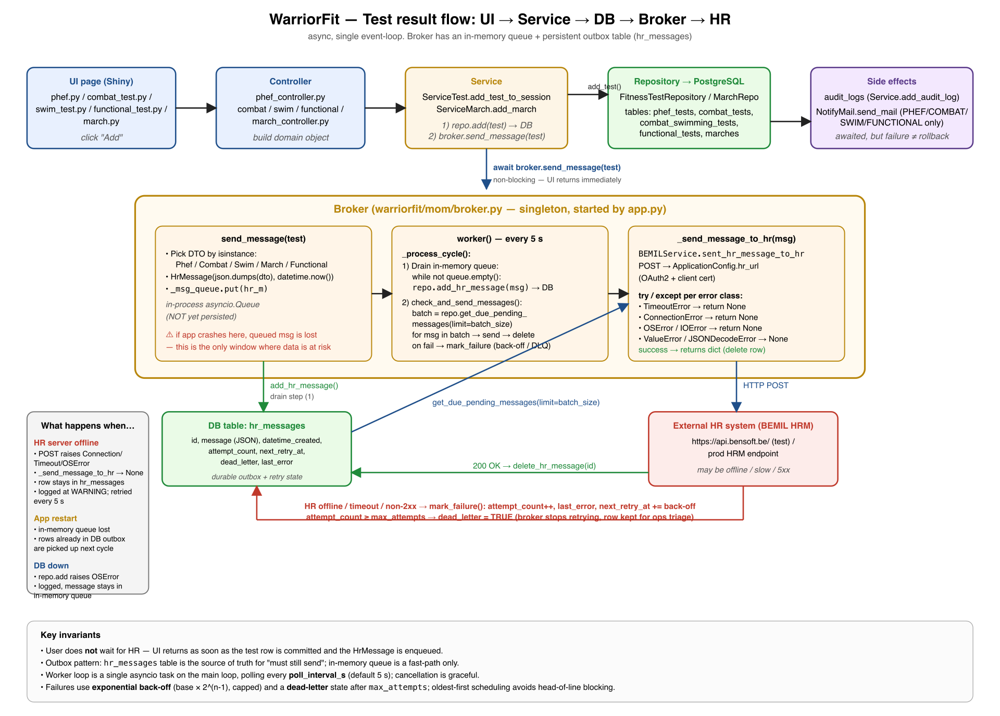

# PHEF test — end-to-end data flow

This document follows **one** PHEF test result from the moment a PTI clicks **Add** in the
browser, through the database, into the Broker, and out to the external HR system. It also
explains what happens if the HR system is down, the app crashes, or the database is
unavailable.

If you only want the picture, here it is:



> The diagram is generic for all fitness tests (PHEF, Combat, Swim, Functional, March)
> because the broker treats them all the same way — only the DTO class is different.
> This document zooms in on **PHEF** specifically.

---

## TL;DR — the one-paragraph version

The PTI types times into a Shiny form. When they press **Add**, the page calls the controller,
the controller builds a `PhefTest` ORM object, and the service persists it to PostgreSQL.
Immediately after the row is committed, the service hands the test to the **Broker**. The
broker turns it into a small JSON message and drops it on an in-memory queue, then returns —
the user's browser is unblocked. A background task wakes up every **5 seconds**, moves
queued messages into the durable `hr_messages` table, picks the oldest pending row, and
POSTs it to the HR system. On success the row is deleted; on **any** failure (HR offline,
timeout, DB down, malformed JSON) the row stays in the table and is retried in the next
5-second cycle. The user never waits for HR.

---

## The two paths in the system

WarriorFit deliberately separates **what the user must wait for** from **what can happen
later**:

| Path                | Synchronous (user waits)            | Asynchronous (broker)                       |
| ------------------- | ----------------------------------- | ------------------------------------------- |
| Goal                | Save the test, give immediate feedback | Replicate the result to the external HR system |
| Failure visibility  | User sees an error in the form         | Logged + retried; user is not bothered        |
| Reliability ceiling | As reliable as the DB                  | Survives HR outages of arbitrary length      |
| Where it lives      | UI → Controller → Service → Repository | Broker (singleton, started by `app.py`)      |

Keeping these apart is what allows the UI to feel snappy even when the HR system is slow
or unreachable.

---

## Step by step — a single PHEF result

### 1. The PTI fills in the form (Shiny page)

File: `warriorfit/ui/pages/phef.py`

The page is reactive: every time the PTI types in *Side bridge R*, *Side bridge L* or
*2400 m run* (`mm:ss`), a small calculator displays the live score next to the field. The
**Add** button stays disabled until two preconditions are met:

1. A test session is selected from the dropdown.
2. The serial number has been confirmed against BEMIL (`Confirm Serial`).

When the PTI clicks **Add** (`input.ph_add_btn`), the reactive effect `_on_add` runs:

1. Validates the form (`_validate(form)`) — re-parses the times to seconds and refuses to
   continue if any field is invalid.
2. Builds a small `payload` dict (`session_id`, `serialnr`, three times in seconds).
3. Calls `self.controller.add_phef(...)`.

If this returns a falsy value, the page shows an error banner and does *nothing else*.
Otherwise it bumps `refresh_tick` (which makes the result grid redraw), shows
`PHEF test added for {serial}`, and clears the form for the next runner.

### 2. The controller maps form → ORM object

File: `warriorfit/ui/controllers/phef_controller.py`

`add_phef()` is intentionally tiny — it only translates a dict into a `PhefTest`
SQLAlchemy entity:

```python
p = PhefTest()
p.test_session_id = int(session_id)
p.serial_number   = payload["serialnr"]
p.running_time    = payload["run2400_s"]
p.sideBridge_r    = payload["side_bridge_r_s"]
p.sideBridge_l    = payload["side_bridge_l_s"]
return await self._service.add_fitness_test_to_testSession(
    int(session_id), p, military, session
)
```

Notice the controller knows *nothing* about the broker, mail, audit log, or HR. That is the
service's job. The controller exists to keep the page free of business logic.

### 3. The service writes to the DB and triggers the side-effects

File: `warriorfit/services/service_test.py` — method `add_fitness_test_to_testSession`

This is the **only place** that orchestrates the complete add operation. In order:

```python
add_test = await self._test_repo.add_fitness_test_to_TestSession(fitness_test, test)
```

1. **Persist to PostgreSQL.** The repository inserts into `phef_tests` (and, via the
   polymorphic `FitnessTest` parent, into `fitness_tests`) and links it to the
   `TestSession`. `add_test` is the row written, or `None` on failure.

If the insert succeeded, the service then runs three side-effects in this order:

2. **Build the e-mail body** (`build_email_body_phef`) — a human-readable summary of the
   PTI, serviceman, scores and pass/fail status. This is just a string; nothing is sent yet.
3. **Hand the test to the Broker** (the focus of this document):

   ```python
   await FitnessWarriorApp.get_broker().send_message(test)
   ```

4. **Send the result e-mail** to the serviceman (`NotifyMail.send_mail`) and **write an
   audit log row** (`Service.add_audit_log`).

Steps 3 and 4 are awaited but their failure does **not** roll back the test row. A failed
mail or a failed broker enqueue is logged; the test result stays in the database. From the
PTI's point of view the operation succeeded the moment step 1 returned.

### 4. The Broker receives the test — `send_message(test)`

File: `warriorfit/mom/broker.py`

`send_message` is short and important. It does three things:

1. **Pick the right DTO** by `isinstance`. For PHEF that is `PhefTestDto`, which copies the
   four fields the HR system cares about:
   ```python
   {
     "serial_number": ...,
     "running_time":  ...,   # 2400 m time in seconds
     "sideBridge_r":  ...,
     "sideBridge_l":  ...,
   }
   ```
2. **Wrap it as an `HrMessage`** — a row-shape that maps onto the `hr_messages` table:
   ```python
   hr_m = HrMessage(
       message=json.dumps(dto.to_dict()),
       datetime_created=datetime.now(),
   )
   ```
3. **Put it on the in-memory queue** (`asyncio.Queue`) and return:
   ```python
   await self._msg_queue.put(hr_m)
   ```

That's it. `send_message` returns to the service, which returns to the controller, which
returns to the page. The PTI's "Add" click is fully handled at this point.

> **The risk window:** between step 3 above and the next worker cycle (≤ 5 s), the
> `HrMessage` exists *only* in process memory. If the application were killed in that
> instant, the message would be lost — but the test row itself is already safe in
> PostgreSQL. So the worst case is "HR didn't get notified", not "PTI's data was lost".

### 5. The Broker's worker — the heartbeat

A background `asyncio.Task` was started by `app.py` during startup
(`Broker.start()`). It runs `worker()`, which is an infinite loop:

```python
while self.running:
    try:
        await self._process_cycle()
    except ...:
        # log but keep looping
    await asyncio.sleep(5)
```

So every **5 seconds** the broker calls `_process_cycle()`. That has two phases.

#### Phase A — drain in-memory queue → DB (`hr_messages` table)

```python
while not self._msg_queue.empty():
    msg = self._msg_queue.get_nowait()
    await repo.add_hr_message(msg)
```

For every queued `HrMessage`, the broker writes it as a row in the **`hr_messages`** table.
After this phase the message is **durable**: even if the app restarts, the row will still
be there next time the worker wakes up.

This is the **outbox pattern**: the database is the single source of truth for "messages
that still need to leave the system". The in-memory queue is just a fast hand-off — it
exists so `send_message()` can return without blocking on a DB write.

#### Phase B — send a batch of due messages, with back-off and dead-letter

```python
due = await repo.get_due_pending_messages(limit=batch_size)
for msg in due:
    ret, err = await self._try_send_to_hr(msg)
    if ret is not None:
        await repo.delete_hr_message(msg.id)
    else:
        await repo.mark_failure(
            msg.id, err,
            max_attempts=max_attempts,
            base_backoff_seconds=base_backoff_s,
            max_backoff_seconds=max_backoff_s,
        )
```

The broker fetches up to `batch_size` rows from `hr_messages` that are **due now** —
meaning they are not in dead-letter and either have never been tried (`next_retry_at IS NULL`)
or their scheduled retry time has passed. They are returned **oldest-first** so that one
permanently-failing newest row cannot starve the rest of the outbox. For each:

- on **success** (HR returns a dict) → the row is deleted.
- on **failure** → the row is updated by `mark_failure(...)`:
  - `attempt_count` is incremented,
  - `last_error` stores a short triage string (e.g. `TimeoutError: HR did not respond`),
  - `next_retry_at` is set to `now + delay`, where
    `delay = min(base_backoff_s × 2^(attempt_count - 1), max_backoff_s)`,
  - once `attempt_count ≥ max_attempts`, the row is flipped to `dead_letter = True`.
    From that moment the broker will never pick it up again — the row stays in the table
    for ops triage (visible via `MomRepository.list_dead_letter()`).

All the knobs come from `config_dev.yml` (and the `broker.*` section of the production
config) via `ApplicationConfig`:

```yaml
broker:
  poll_interval_s: 5      # how often the worker wakes up
  batch_size: 5           # rows attempted per cycle
  max_attempts: 10        # after this many failures → dead-letter
  base_backoff_s: 5       # first retry waits 5 s
  max_backoff_s: 600      # cap delay at 10 min
```

With the defaults, a row goes through delays of 5 s, 10 s, 20 s, 40 s, 80 s, 160 s, 320 s,
600 s, 600 s, 600 s before being marked dead-letter — about **41 minutes** of patient
retrying before HR has to be considered permanently broken for that message.

### 6. The HTTP call — `_send_message_to_hr`

This is where the broker meets the outside world. It is wrapped in a wide try / except
block on purpose. Every realistic failure is caught and turned into `return None`:

| Exception                              | What it usually means                          |
| -------------------------------------- | ---------------------------------------------- |
| `asyncio.TimeoutError`                 | HR didn't respond in time                      |
| `ConnectionError`                      | HR refused, DNS failure, TLS handshake failed  |
| `OSError` / `IOError`                  | Network down, socket reset                     |
| `ValueError` / `json.JSONDecodeError`  | HR replied with garbage / our payload is bad   |
| `AttributeError`                       | HR client API broke or HrMessage malformed     |

The exception is logged with `extra={...}` (message id, HR url, error type) for
observability, but it is **not re-raised**. Returning `None` is what triggers the retry
loop above.

---

## What happens when the HR server is offline?

This is the most common failure mode in practice. It is handled entirely by the outbox +
poll loop:

1. The PTI clicks **Add**. PHEF row is committed to `phef_tests`. UI says
   "PHEF test added".
2. `send_message` enqueues an `HrMessage` and returns.
3. Within `poll_interval_s` (default 5 s) the worker drains the queue → the `HrMessage`
   row is now in `hr_messages` with `attempt_count = 0`, `next_retry_at = NULL`.
4. `_send_message_to_hr` POSTs to HR → connection refused / timeout / 5xx.
5. The exception is caught, a `WARNING` log line is written, `_try_send_to_hr` returns
   `(None, "ConnectionError: ...")`.
6. `mark_failure` updates the row: `attempt_count = 1`, `last_error = "ConnectionError…"`,
   `next_retry_at = now + 5 s`. The row stays in `hr_messages`. The PTI is **not**
   notified. The PHEF result remains visible and correct in the WarriorFit UI.
7. The worker tries again 5 s later, then 10 s later, then 20 s, 40 s, 80 s, …
   capped at `max_backoff_s` (default 10 min). HR is hit at most ~30 times in the first
   hour instead of ~720.
8. Eventually HR comes back online. The next POST succeeds, returns a JSON dict. The row
   is deleted. From HR's point of view the result simply arrived a bit late.

**No data is lost** in this scenario, because the test result lives in two independent
places:
- the authoritative PHEF row in PostgreSQL (the result itself), and
- the HR-replication intent in `hr_messages` (the "still need to send this" marker, with
  full retry bookkeeping in `attempt_count` / `next_retry_at` / `last_error`).

### What if HR can never accept the message? (poison messages)

A genuinely-broken message — wrong schema, deleted serial number, anything HR would
*always* reject — would otherwise be retried forever. The broker now caps this:

- After `max_attempts` failures (default **10**), `mark_failure` sets `dead_letter = TRUE`.
- The next `get_due_pending_messages` skips the row (the query filters
  `dead_letter = FALSE`).
- The row is **kept** for ops triage; it does *not* delete itself. `last_error` records
  the most recent failure reason.
- Operators can list parked rows via `MomRepository.list_dead_letter()` and either
  inspect/fix the data or mark them resolved manually (a UI for this is not implemented
  yet — see "Limitations" below).

This means a single bad message can no longer prevent the rest of the outbox from being
processed, *and* it can no longer hammer the HR endpoint indefinitely.

### Limitations still in place (intentional, not bugs)

- **One process / one worker task.** The broker is a singleton inside the Shiny process;
  there is no separate worker container. If the app is stopped, sending pauses until the
  next boot (the table state is preserved, so it just resumes).
- **No admin UI for the dead-letter table.** Inspecting and acting on parked rows today
  requires a SQL session or an ops script. A small admin page (list / view payload /
  re-queue / delete) would be a natural next step.
- **No metrics endpoint.** Observability is via structured log lines (`message_id`,
  `attempts`, `last_error`); a Prometheus counter for `outbox_pending`,
  `outbox_dead_letter`, `outbox_send_seconds` would help in production.

---

## Other failure modes, briefly

**App restarts** — In-memory queue is lost. Anything that was already drained to
`hr_messages` is fine and will be picked up by the new worker on next cycle. Anything
queued in the last < 5 s before the crash is lost (but the PHEF row in `phef_tests` is
intact).

**DB unavailable** — `repo.add_hr_message` raises `OSError` / `IOError`. The broker logs
the error and *leaves* the message in the in-memory queue (the `while not empty` loop
breaks on the exception), so it will be re-tried on the next cycle. Note: if the app dies
before the DB comes back, those messages are lost — durability requires the DB to be
reachable at least once before a restart.

**Mail server down** — Independent of HR. The PHEF row is saved, the HR message is queued,
but `NotifyMail.send_mail` will raise. The exception is *not* caught in the service, so it
propagates back to the controller; the controller already received `add_test = True`,
so the PHEF test is still considered "added". The PTI sees the result in the grid; the
serviceman just doesn't get an e-mail.

**Validation fails on the form** — The `_validate(form)` call in `_on_add` short-circuits
*before* anything is persisted. No DB write, no broker call, no audit log. The form shows
the error and stays open.

---

## Summary of the contract

- **The PTI never waits for HR.** Their UI latency is bounded by the local DB write.
- **The PHEF row is the source of truth for the *result*.** It is committed before any
  side-effect is attempted.
- **`hr_messages` is the source of truth for the *replication*.** The queue is a cache.
- **HR outages are absorbed silently** by the 5-second poll loop. Recovery is automatic.
- **Failures are logged, not surfaced.** The PTI does not see HR errors. Operators see
  them in logs; persistent rows in `hr_messages` are the operational signal that
  something is stuck.

If you need to reason about *any* fitness-test write path (PHEF, Combat, Swim, Functional,
March), the same rules apply. Only step 4's DTO class changes.
