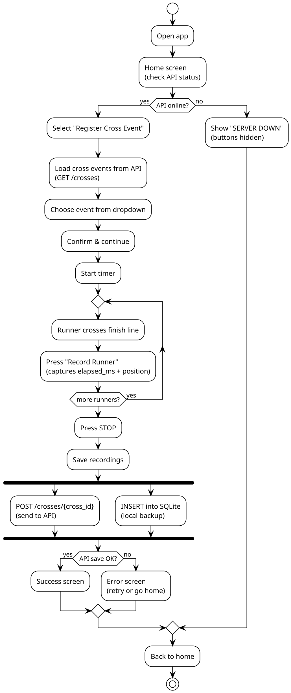
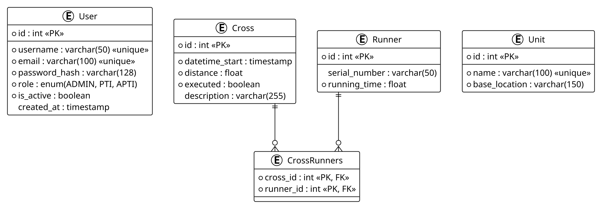

# WarriorFit Cross/Running Event System

## Overview

The Cross/Running Event system is a **two-component architecture** for timing and recording cross-country running events in the field. A **Flet mobile/desktop client** is used by PTIs to time runners on-site, while a **FastAPI backend** manages event data, persists results, and enforces access control.

## Git Repositories

- [Flet Client](https://github.com/BenoitGoethals/fletTestCase) - Mobile/desktop timer application
- [Backend API](https://github.com/BenoitGoethals/CrossClientAPIWarriorFit) - FastAPI REST service

---

## Goals

- Provide a field-ready UI for timing and recording cross/running events
- Persist recorded timings locally (SQLite) for offline/unstable network scenarios
- Sync results with the backend API when connectivity is available
- Secure API access with OAuth2 + JWT and role-based authorization
- Share the same PostgreSQL database as the main WarriorFit application

---

## System Architecture


---

## Flet Client (`fletTestCase`)

### Tech Stack

| Component | Technology |
|-----------|-----------|
| UI Framework | Flet 0.28.3 (Flutter-based Python UI) |
| HTTP Client | httpx (async, mTLS support) |
| Validation | Pydantic |
| Local Storage | SQLite |
| Config | YAML (`config.yml`) |
| Packaging | uv / Docker |

### Project Structure

```
fletTestCase/
  src/
    main.py               # Entry point (Flet web mode)
    desktop_run.py         # Entry point (desktop mode)
    ui.py                  # RunningEventApp - all UI screens
    models.py              # CrossEvent, Recording dataclasses
    protocols.py           # CrossProvider, RecordingSaver (Protocol classes)
    services.py            # RequestsApiClient, SqliteRecordingRepository,
                           # CompositeRecordingSaver, Stopwatch
    schemas.py             # Pydantic validation schemas
    utils.py               # format_ms(), api_online()
    version_loader.py      # Load version from version.yaml
    certs/                 # mTLS client certificates
    assets/                # App logo image
  storage/
    recordings.db          # SQLite local database
  pyproject.toml           # Dependencies and Flet config
  Dockerfile               # Web deployment
  version.yaml             # App version
```

### Key Classes

| Class | File | Responsibility |
|-------|------|----------------|
| `RunningEventApp` | `ui.py` | Main app class - 6 screens: home, event selection, timer, success, error, results |
| `Stopwatch` | `services.py` | High-resolution timer using `time.time()` with start/stop/elapsed |
| `RequestsApiClient` | `services.py` | Implements `CrossProvider` + `RecordingSaver` via httpx with mTLS and OAuth2 |
| `SqliteRecordingRepository` | `services.py` | Local SQLite persistence (offline backup) |
| `CompositeRecordingSaver` | `services.py` | Saves to multiple destinations (API + SQLite) using composite pattern |
| `CrossEvent` | `models.py` | Frozen dataclass: `id`, `description`, `datetime_start` |
| `Recording` | `models.py` | Frozen dataclass: `number`, `time_ms`, `position`, `formatted_time` |

### User Flow



### Authentication

The client supports two authentication methods:
1. **API Key** - `X-API-Key` header (simple, for trusted environments)
2. **OAuth2** - Username/password login to `/token` endpoint, receives JWT bearer token

Authentication is configured via `config.yml` and supports automatic token refresh on 401 responses.

### Deployment

| Mode | Entry Point | Command |
|------|-------------|---------|
| Desktop | `desktop_run.py` | `flet run src/desktop_run.py` |
| Web | `main.py` | `flet run --web src/main.py` |
| Docker | `main.py` | `docker build -t warriorfit-cross . && docker run -p 8550:8550 warriorfit-cross` |

---

## Backend API (`CrossClientAPIWarriorFit`)

### Tech Stack

| Component | Technology |
|-----------|-----------|
| Framework | FastAPI |
| ORM | SQLAlchemy 2.0 (async) |
| Database | PostgreSQL (asyncpg) |
| Auth | OAuth2 + JWT (python-jose) |
| Password Hashing | Argon2id (with bcrypt migration) |
| Validation | Pydantic v2 |
| TLS | Uvicorn with SSL certificates |
| CORS | Enabled for all origins |

### Project Structure

```
CrossClientAPIWarriorFit/
  src/
    main.py                    # FastAPI app, endpoints, middleware
    core/
      auth.py                  # Role-based access control (require_roles)
      oauth2.py                # JWT creation, Argon2 password verify, token decode
      config_reader.py         # YAML config loader
      db_connection.py         # Async SQLAlchemy engine + session
      ssl_validator.py         # Certificate validation on startup
      lifespan.py              # FastAPI lifespan events
      logging_config.py        # Structured logging setup
      version_loader.py        # Version from YAML
    data/
      model/
        db_model.py            # ORM: User, Cross, Runner, CrossRunners, Unit
        schemas.py             # Pydantic: CrossResponse, RunnerCreate, Token, etc.
        role.py                # Role enum (ADMIN, PTI, APTI)
      repo/
        cross_repository.py    # Async CRUD for Cross, Runner, User credentials
    certs/                     # SSL certificates
  config.yml                   # Database, API, auth settings
  Dockerfile                   # Production deployment
  version.yaml                 # API version
```

### API Endpoints

| Method | Path | Description | Auth |
|--------|------|-------------|------|
| `GET` | `/` | Redirect to `/docs` | Public |
| `POST` | `/token` | OAuth2 login, returns JWT | Public |
| `GET` | `/crosses` | List all unexecuted cross events | PTI, ADMIN, APTI |
| `GET` | `/crosses/{id_cross}` | Get cross by ID with runners | PTI, ADMIN, APTI |
| `POST` | `/crosses/{cross_id}` | Save multiple runner recordings | PTI, ADMIN, APTI |
| `POST` | `/crosses/{serial}/{id_cross}` | Add runner by serial number | PTI, ADMIN, APTI |
| `GET` | `/crosses/runners/{cross_id}` | Get all runners for a cross | PTI, ADMIN, APTI |

### Data Model



The `Cross`, `Runner`, `CrossRunners`, and `Unit` tables are **shared with the main WarriorFit application** (same PostgreSQL database). The API reads cross events created by WarriorFit and writes runner results back.

### Security

| Feature | Implementation |
|---------|---------------|
| Password hashing | Argon2id (auto-migrates from bcrypt on login) |
| Token auth | JWT with configurable expiry |
| Role-based access | `require_roles(["PTI", "ADMIN", "APTI"])` dependency |
| Input validation | Pydantic schemas + Path constraints |
| SQL injection prevention | SQLAlchemy ORM parameterized queries |
| TLS | Uvicorn SSL + client certificate support |
| Auth audit logging | Dedicated `auth` logger for failed login attempts |
| CORS | Enabled (configurable origins) |

### Deployment

```bash
# Development
uvicorn src.main:app --host 0.0.0.0 --port 8555 --ssl-keyfile src/certs/key.pem --ssl-certfile src/certs/cert.pem

# Docker
docker build -t warriorfit-cross-api .
docker run -p 8555:8555 -v /etc/WarriorFit/config.yml:/app/config.yml warriorfit-cross-api
```

---

## End-to-End Data Flow


---


## Screenshots


