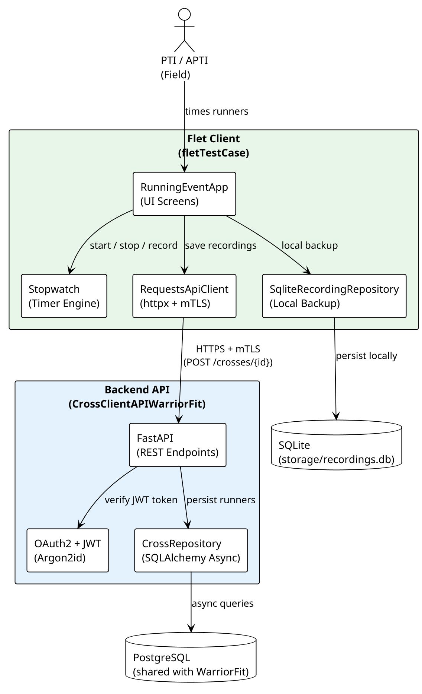

# WarriorFit Cross/Running Event System

## Goal

The Cross/Running Event system is a **three-component architecture** for timing and recording cross-country running events in the field.

| Component | Technology | Role |
|-----------|------------|------|
| **WarriorFit** | Shiny for Python | Planning, results management, statistics |
| **FastAPI Backend** | FastAPI + PostgreSQL | Shared data persistence and REST API |
| **Flet Client** | Flet (mobile/desktop) | On-site runner timing by PTIs |

## Git Repositories

- [Flet Client](https://github.com/BenoitGoethals/fletTestCase) — mobile/desktop timer application
- [Backend API](https://github.com/BenoitGoethals/CrossClientAPIWarriorFit) — FastAPI REST service

---

## System Architecture

```
┌─────────────────────┐        REST API        ┌──────────────────────┐
│   Flet Client       │◄──────────────────────►│   FastAPI Backend    │
│  (PTI on field)     │   JWT-authenticated     │  /api/cross/...      │
│                     │   HTTP/HTTPS            │  /api/runners/...    │
└─────────────────────┘                         └──────────┬───────────┘
                                                           │
                                                    Shared PostgreSQL
                                                    (Cross, Runner tables)
                                                           │
                                                ┌──────────▼───────────┐
                                                │  WarriorFit (Shiny)  │
                                                │  CrossRepository     │
                                                │  ServiceCross        │
                                                │  Cross Planning page │
                                                │  Cross Statistics    │
                                                └──────────────────────┘
```

### Overview Screenshots




### Online version
<https://clientcross.bensoft.be/>

---

## Data Models

The backend and WarriorFit share the same PostgreSQL database. The relevant entities are defined in `warriorfit/data/model/db_model.py`.

### Cross (session)

| Field | Type | Description |
|-------|------|-------------|
| `id` | UUID / int | Primary key |
| `start` | datetime | Event date and time |
| `distance` | float | Distance in km |
| `executed` | bool | Whether the event took place |
| `description` | str | Free-text description |

### Runner (result)

| Field | Type | Description |
|-------|------|-------------|
| `id` | UUID / int | Primary key |
| `cross_id` | FK → Cross | Which cross session |
| `serial` | str | Serviceman serial number |
| `running_time` | str | Formatted time (hh:mm:ss) |
| `seconds` | int | Running time in seconds (calculated) |
| `order` | int | Finish order (auto-assigned) |

---

## Integration: Flet ↔ FastAPI Backend

The Flet client communicates with the FastAPI backend over HTTPS. Authentication uses JWT tokens obtained at login.

### Authentication Flow

```
Flet Client                          FastAPI Backend
    │                                      │
    │── POST /auth/login ─────────────────►│
    │   {username, password}               │
    │                                      │
    │◄── {access_token, token_type} ───────│
    │                                      │
    │── GET /api/cross/  ─────────────────►│
    │   Authorization: Bearer <token>      │
    │◄── [Cross session list] ─────────────│
```

### Key API Endpoints (FastAPI Backend)

| Method | Path | Description |
|--------|------|-------------|
| `POST` | `/auth/login` | Obtain JWT access token |
| `GET` | `/api/cross/` | List cross sessions |
| `GET` | `/api/cross/{id}` | Get a single cross session |
| `GET` | `/api/runners/{cross_id}` | List runners for a session |
| `POST` | `/api/runners/` | Submit a runner result |
| `PUT` | `/api/runners/{id}` | Update a runner result |
| `DELETE` | `/api/runners/{id}` | Remove a runner result |

---

## Integration: WarriorFit ↔ PostgreSQL

WarriorFit accesses the cross data directly via its async SQLAlchemy stack. No HTTP hop is needed — it queries the shared database.

```
WarriorFit (Shiny)
    │
    ├── CrossPlanningController   →  ServiceCross  →  CrossRepository  →  PostgreSQL
    │   (create/edit/delete cross sessions)
    │
    ├── CrossController           →  ServiceCross  →  CrossRepository  →  PostgreSQL
    │   (enter/update/delete runner results)
    │
    └── CrossStaticsController    →  ServiceCross  →  CrossRepository  →  PostgreSQL
        (Top 10 rankings per distance)
```

Relevant WarriorFit source files:

| File | Responsibility |
|------|---------------|
| `warriorfit/services/service_cross.py` | Cross business logic |
| `warriorfit/data/repositories/cross_repository.py` | Cross DB queries |
| `warriorfit/ui/controllers/cross_controller.py` | Runner CRUD for the page |
| `warriorfit/ui/controllers/cross_planning_controller.py` | Session CRUD for the page |
| `warriorfit/ui/controllers/cross_statics_controller.py` | Statistics queries |
| `warriorfit/ui/pages/cross.py` | Runner entry page |
| `warriorfit/ui/pages/cross_planning.py` | Session planning page |
| `warriorfit/ui/pages/cross_statics.py` | Statistics page |

---

## End-to-End Workflow

```
1. PTI creates cross session in WarriorFit (Cross Planning page)
      └─► stored in PostgreSQL via CrossRepository

2. PTI opens Flet client on-site (mobile or desktop)
      └─► authenticates with FastAPI backend (JWT)

3. Flet client fetches cross sessions from FastAPI backend
      └─► GET /api/cross/  →  FastAPI reads same PostgreSQL

4. PTI selects the session and starts timing runners

5. For each runner finishing:
      ├─► PTI enters serial number and finish time
      └─► POST /api/runners/  →  FastAPI persists to PostgreSQL

6. Back at base, WarriorFit automatically shows updated results
      └─► CrossController reads from same PostgreSQL

7. PTI views top-10 statistics in WarriorFit (Cross Statistics page)
```

---

## Screenshots


