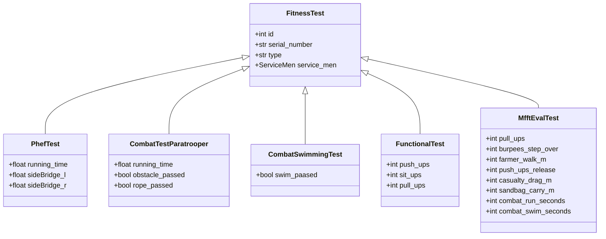

# 1. DataModel

# 2. Entity Relationship Diagram

# 3. class diagram

---

# 4. MFFT Eval — additions (2026-06)

`MfftEvalTest` is a joined-table subtype of `FitnessTest` (polymorphic
identity `mfft_eval_test`). Each row stores the 8 raw event measurements:

| Column | Type | Notes |
|---|---|---|
| `id` | `Integer FK → fitness_tests.id` | inherited primary key |
| `pull_ups` | `Integer` | event 1 (reps) |
| `burpees_step_over` | `Integer` | event 2 (reps) |
| `farmer_walk_m` | `Integer` | event 3 (meters) |
| `push_ups_release` | `Integer` | event 4 (reps) |
| `casualty_drag_m` | `Integer` | event 5 (meters) |
| `sandbag_carry_m` | `Integer` | event 6 (meters) |
| `combat_run_seconds` | `Integer` | event 7 (timed) |
| `combat_swim_seconds` | `Integer` | event 8 (timed) |

The discriminator value `mfft_eval_test` is also added to the
`TypeFitnessTest` Python enum AND to the PostgreSQL `typefitnesstest` enum
type (see migration `f6a7b8c9d0e1`).

## `ServiceMen.cluster` — derived property

`ServiceMen.cluster` is **not** a stored column. It is a `@property` that
returns:

- `Cluster.COMBAT` when `self.para` is `True`
- `Cluster.ENABLER` otherwise

Migration `a7b8c9d0e1f2` drops the temporary `cluster` column that was added
when MFFT first shipped — the rule is too simple to justify a stored value.

## Class diagram (FitnessTest polymorphic hierarchy)

