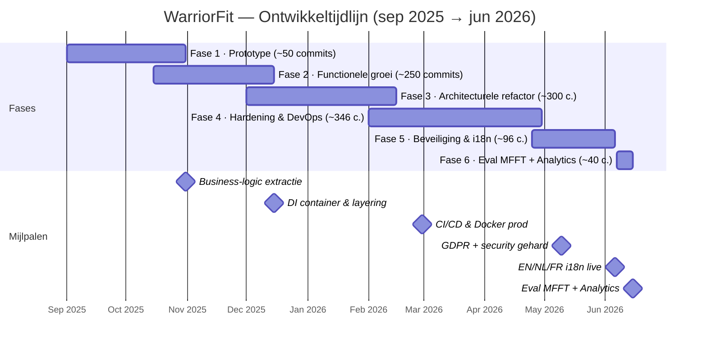
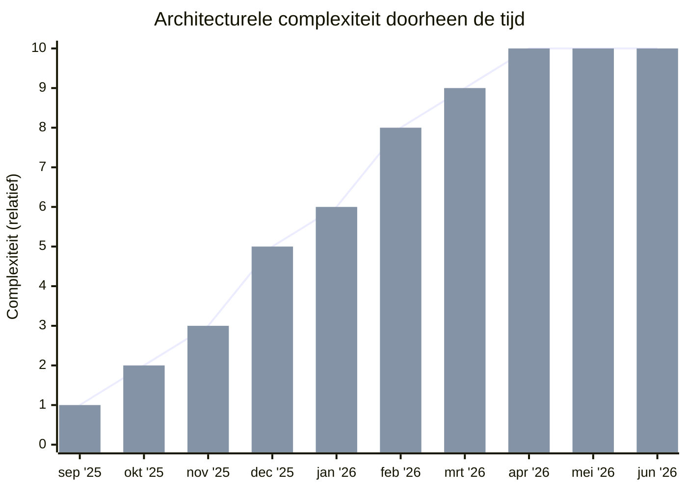

# WarriorFit — Code Evolution

**~1 050 commits** over ~10 maanden (sep 2025 – jun 2026) — nu ~27.500 regels Python.

---

## Tijdlijn

## Complexiteitsgroei

| Fase | Periode | Complexiteit | Architectuur |
|---|---|---|---|
| 1 — Prototype | sep–okt 2025 | laag | Monoliet |
| 2 — Features & Calculators | okt–dec 2025 | middel | Emerging layers |
| 3 — Layered DI | dec 2025–feb 2026 | hoog | DI container |
| 4 — Hardening & CI/CD | feb–apr 2026 | hoog | Productie-klaar |
| 5 — Beveiliging & i18n | apr–jun 2026 | hoog | OWASP-gehard, GDPR-compliant, EN/NL/FR |
| 6 — Eval MFFT + Analytics | jun 2026 | hoog | 5e testtype, cohort-analytics, afgeleide cluster |

## Architectuurevolutie

```mermaid
flowchart TB
    subgraph F1["FASE 1 — Prototype"]
        direction TB
        F1U[Shiny Pages] --> F1S["DBService<br/><i>god-class</i>"] --> F1DB[(PostgreSQL)]
    end

    subgraph F2["FASE 2 — Functionele groei"]
        direction TB
        F2U[Shiny Pages] --> F2C["PhefCalc<br/>ExtService"]
        F2U --> F2S["DBService<br/><i>uitgebreid</i>"]
        F2C --> F2S
        F2S --> F2DB[(PostgreSQL)]
    end

    subgraph F34["FASE 3 & 4 — Layered + DevOps"]
        direction TB
        F3U["Shiny Pages (RBAC)"] --> F3C[Controllers]
        F3C --> F3S["Services<br/>+ Broker · + Mail"]
        F3S --> F3R["Repositories (async)"]
        F3R --> F3M["ORM Models<br/><i>polymorf</i>"]
        F3M --> F3DB[(PostgreSQL)]
    end

    subgraph F6["FASE 6 — Eval MFFT + Analytics"]
        direction TB
        F6U["MFFT Eval · Analytics<br/>5 pagina's bijgewerkt"] --> F6C["MfftEvalController<br/>TestAnalyticsController"]
        F6C --> F6S["ServiceTest (+MFFT)<br/>DataCollector (+MFFT)"]
        F6S --> F6L["MfftEvalCalculator<br/>(5 clusters · 4 tiers)"]
        F6L --> F6R["FitnessTestRepository<br/>(polymorf incl. MFFT)"]
        F6R --> F6M["MfftEvalTest<br/>ServiceMen.cluster @property"]
        F6M --> F6DB[(PostgreSQL)]
    end

    F1 --> F2 --> F34 --> F6

    classDef ui    fill:#e3f2fd,stroke:#1565c0,color:#0d47a1;
    classDef svc   fill:#e0f7fa,stroke:#00838f,color:#006064;
    classDef logic fill:#f3e5f5,stroke:#6a1b9a,color:#4a148c;
    classDef repo  fill:#fff3e0,stroke:#ef6c00,color:#e65100;
    classDef db    fill:#fce4ec,stroke:#ad1457,color:#880e4f;
    class F1U,F2U,F3U,F6U ui
    class F1S,F2S,F2C,F3C,F3S,F6C,F6S svc
    class F6L logic
    class F3R,F3M,F6R,F6M repo
    class F1DB,F2DB,F3DB,F6DB db
```

> Fase 3 & 4 brengen bovendien: **DI Container · CI/CD pipeline · Docker · MkDocs**.
> Fase 5 voegt toe: **OWASP hardening · GDPR-compliance · NIST CSF 2.0 · PostgreSQL TLS · military UI thema · EN/NL/FR i18n**.
> Fase 6 voegt toe: **Eval MFFT (5e testtype, 8 events, 5 clusters) · Analytics-pagina · afgeleide cluster `@property` · landscape PDF-rapporten**.

---

## Fase 1: Prototype (sep–okt 2025) — commits 1–~50

**Complexiteit: laag | Architectuur: monolithisch**

- Eén Shiny app met een paar pagina's, alles in een platte structuur
- `DBService` als god-class die alle database-operaties bevat
- Directe databasecalls vanuit UI-pagina's
- Geen DI, geen layering — pagina's praten rechtstreeks met de service
- Login/auth rudimentair (password hashing met Argon2 kwam al vroeg)
- Veel iteratief refactoren op dezelfde pagina's (PhefPage had tientallen commits)
- Eerste Alembic migratie, basismodellen met polymorphe `FitnessTest`

## Fase 2: Functionele groei (okt–dec 2025) — commits ~50–300

**Complexiteit: middel | Architectuur: emerging layers**

- Nieuwe pagina's: CombatPage, DashboardPage (met Plotly), SessionsPage
- `PhefCalculator` geïntroduceerd — eerste business logic buiten de UI
- `DefenseExternalService` (singleton) voor externe HR-integratie
- Role-based access control (6 rollen: ADMIN, PTI, APTI, etc.)
- Config via YAML, `Singleton` metaclass pattern
- Nog steeds veel logica in de pagina-classes zelf

## Fase 3: Architecturele refactor (dec 2025–feb 2026) — commits ~300–600

**Complexiteit: hoog | Architectuur: gelaagde DI-architectuur**

- **Grote omslag**: introductie van `dependency-injector` (`DeclarativeContainer`)
- Opsplitsing in duidelijke lagen: **UI → Controllers → Services → Repositories → Models**
- Repositories met `async_sessionmaker` / `AsyncSession`
- Message broker (`mom/broker.py`) voor async achtergrondverwerking (HR-integratie)
- Mail service met SMTP health checks
- Audit logging systeem
- Cross-run rapporten en PDF-generatie
- Reserveringssysteem toegevoegd
- Unit tests (pytest) met singleton isolation

## Fase 4: Hardening & DevOps (feb–apr 2026) — commits ~600–946

**Complexiteit: hoog | Architectuur: productie-klaar**

- CI/CD: GitHub Actions met Ruff, mypy strict mode, formatting checks
- Docker productie-configuratie (`SHINY_DEV_MODE=false`, secret management)
- MkDocs documentatie
- OWASP security review en fixes
- Code quality: `ruff check`, `mypy strict`, `black` formatting
- Type annotations over de hele codebase (al zijn er nog `# type: ignore`'s)
- PR-workflow via GitHub (merge requests, code review)

## Fase 5: Beveiliging & i18n (apr–jun 2026) — commits ~946–~1 040

**Complexiteit: hoog | Architectuur: OWASP-gehard, GDPR-compliant, EN/NL/FR**

- GDPR-compliance: consent-tabel per service-number, Privacy self-service pagina (Art. 7/15/20), data-retentie service
- NIST CSF 2.0 zelfanalyse; PostgreSQL SSL/TLS met certificaatvalidatie
- OWASP-hardening: MOM-endpoint met `X-API-Key`, IDOR-fix op test-deletes, `UserStore` per Shiny-sessie (PR #217)
- Militair UI-thema: Rajdhani + JetBrains Mono fonts, olive-drab / khaki / amber kleurensysteem
- Broker-resilience: exponentiële back-off, batch-send, dead-letter queue + uitgebreide unit tests
- Internationalisering: `warriorfit/i18n/` module, EN/NL/FR catalogi (~498 sleutels), taalkiezer-dropdown in navbar

## Fase 6: Eval MFFT + Analytics (jun 2026) — commits ~1 040–~1 050

**Complexiteit: hoog | Architectuur: 5e testtype geïntegreerd, cohort-analytics, afgeleide cluster**

- **Eval MFFT** — nieuwe 8-event jaarlijkse functionele test van de Landmacht, volledige implementatie (PR #227):
  - Polymorf `MfftEvalTest` subtype (8 resultaatkolommen), `TypeFitnessTest.MFFT_EVAL`, `ReportType.MFFT_EVAL`
  - Enums `Cluster` (`COMBAT / ENABLER / OPS_SP / TER_SP / NON_DEP`) en `MfftLevel` (`GOLD / SILVER / BRONZE / FIT / UNFIT`)
  - `MfftEvalCalculator` met de officiële drempelmatrix; 30 unit tests die elke cluster, elke event-grens en de invariant `passed ⇔ overall != UNFIT` afdekken
  - Eigen MFFT Eval-pagina met live per-event tier-badges en strikte invoervalidatie (weigert 0, niet-numeriek, foutief `mm:ss`)
- **Analytics-pagina** (nieuw) — coverage gauges, slaagpercentage per leeftijdsgroep, maandelijkse trend, MFFT-bottleneck bar, per-event histogrammen met niveau-drempels
- **Cross-cutting integratie** — MFFT zichtbaar in Dashboard, Status Eenheid, Individueel / Mijn Voortgang, Rapporten (CSV + landscape A4 PDF), broker DTO-dispatch, Status (niet gedaan) selector
- **Afgeleide cluster-refactor** — `ServiceMen.cluster` van opgeslagen kolom naar `@property` (para → COMBAT, anders → ENABLER); geen call-site wijzigingen nodig
- **Bug fix** — `FitnessTestRepository.add_test_session` flusht nu vóór refresh (ontdekt via de MFFT-enum mismatch)
- SQL bootstrap-scripts: volledig schema + seed data voor lokale / staging-setups

---

## Samenvatting

| Aspect | Begin | Nu |
|---|---|---|
| **Structuur** | Platte bestanden | 7+ packages, gelaagd |
| **DI** | Geen | `DeclarativeContainer` |
| **DB access** | God-class `DBService` | Repository pattern, async |
| **Business logic** | In UI-pagina's | Calculators, Services, Controllers |
| **Testtypes** | 1 (PHEF) | 5 (PHEF, Combat, Functional, Swimming, **MFFT Eval**) |
| **Auth** | Simpele login | RBAC met 6 rollen, OWASP-gehard |
| **Testing** | Geen | Pytest met DB-isolation + Broker-tests + 30 MFFT-tests |
| **CI/CD** | Geen | GitHub Actions, Docker |
| **Docs** | Geen | MkDocs site, ARCHITECTURE.md, DPIA, Privacy Policy |
| **Compliance** | Geen | GDPR (Art. 7/15/20), NIST CSF 2.0, PostgreSQL TLS |
| **Talen** | Geen i18n | EN / NL / FR catalogi |

Het patroon is klassiek en gezond: **werkend prototype → features toevoegen → architectureel herstructureren → hardenen voor productie → compliance & beveiliging → uitbreidbaarheid via nieuwe testtypes**. De grootste sprongen in maturiteit waren de introductie van dependency injection (fase 3) en de OWASP/GDPR-hardening pass (fase 5); fase 6 bewijst dat het layered architecture pattern uitbreiding aankan — Eval MFFT werd in één sprint volledig toegevoegd zonder bestaande consumers te raken.
