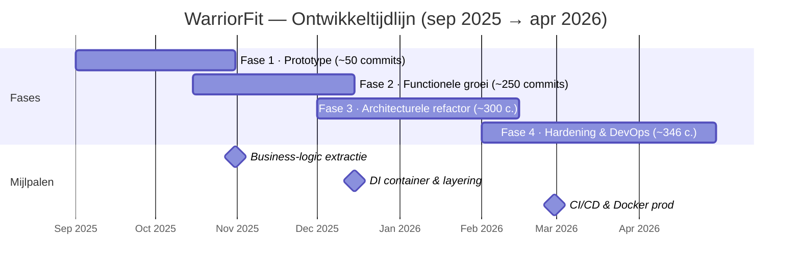
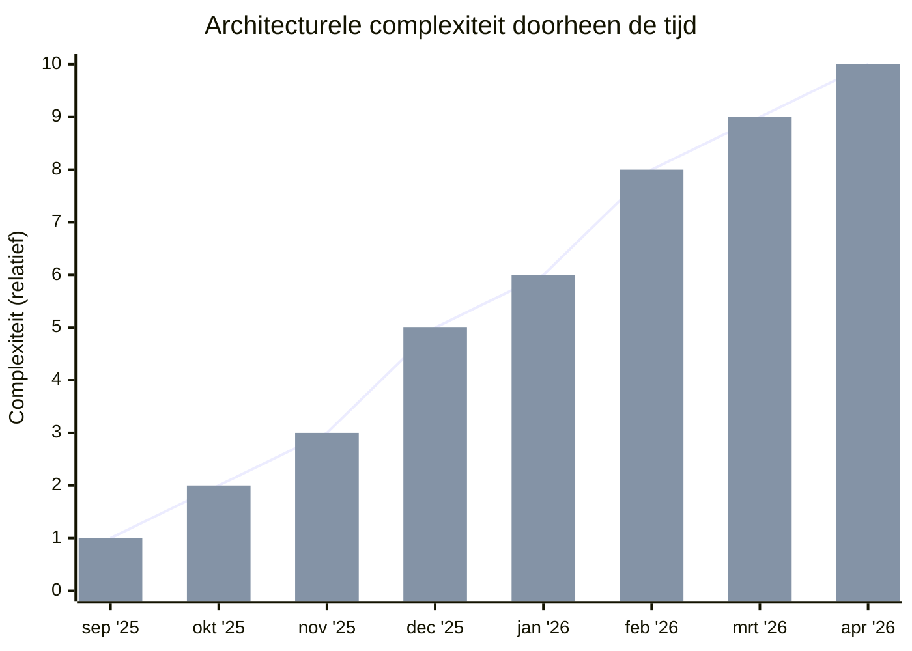
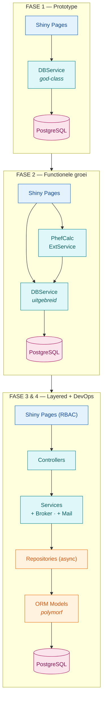

# WarriorFit — Code Evolution

**946 commits** over ~7 maanden (sep 2025 – apr 2026) — nu ~21.800 regels Python.

---

## Tijdlijn

## Complexiteitsgroei

| Fase | Periode | Complexiteit | Architectuur |
|---|---|---|---|
| 1 — Prototype | sep–okt 2025 | laag | Monoliet |
| 2 — Features & Calculators | okt–dec 2025 | middel | Emerging layers |
| 3 — Layered DI | dec 2025–feb 2026 | hoog | DI container |
| 4 — Hardening & CI/CD | feb–apr 2026 | hoog | Productie-klaar |

## Architectuurevolutie

> Fase 3 & 4 brengen bovendien: **DI Container · CI/CD pipeline · Docker · MkDocs**.

---

## Fase 1: Prototype (sep–okt 2025) — commits 1–~50

**Complexiteit: laag | Architectuur: monolithisch**

- Eén Shiny app met een paar pagina's, alles in een platte structuur
- `DBService` als god-class die alle database-operaties bevat
- Directe databasecalls vanuit UI-pagina's
- Geen DI, geen layering — pagina's praten rechtstreeks met de service
- Login/auth rudimentair (password hashing met Argon2 kwam al vroeg)
- Veel iteratief refactoren op dezelfde pagina's (PhefPage had tientallen commits)
- Eerste Alembic migratie, basismodellen met polymorphe `FitnessTest`

## Fase 2: Functionele groei (okt–dec 2025) — commits ~50–300

**Complexiteit: middel | Architectuur: emerging layers**

- Nieuwe pagina's: CombatPage, DashboardPage (met Plotly), SessionsPage
- `PhefCalculator` geïntroduceerd — eerste business logic buiten de UI
- `DefenseExternalService` (singleton) voor externe HR-integratie
- Role-based access control (6 rollen: ADMIN, PTI, APTI, etc.)
- Config via YAML, `Singleton` metaclass pattern
- Nog steeds veel logica in de pagina-classes zelf

## Fase 3: Architecturele refactor (dec 2025–feb 2026) — commits ~300–600

**Complexiteit: hoog | Architectuur: gelaagde DI-architectuur**

- **Grote omslag**: introductie van `dependency-injector` (`DeclarativeContainer`)
- Opsplitsing in duidelijke lagen: **UI → Controllers → Services → Repositories → Models**
- Repositories met `async_sessionmaker` / `AsyncSession`
- Message broker (`mom/broker.py`) voor async achtergrondverwerking (HR-integratie)
- Mail service met SMTP health checks
- Audit logging systeem
- Cross-run rapporten en PDF-generatie
- Reserveringssysteem toegevoegd
- Unit tests (pytest) met singleton isolation

## Fase 4: Hardening & DevOps (feb–apr 2026) — commits ~600–946

**Complexiteit: hoog | Architectuur: productie-klaar**

- CI/CD: GitHub Actions met Ruff, mypy strict mode, formatting checks
- Docker productie-configuratie (`SHINY_DEV_MODE=false`, secret management)
- MkDocs documentatie
- OWASP security review en fixes
- Code quality: `ruff check`, `mypy strict`, `black` formatting
- Type annotations over de hele codebase (al zijn er nog `# type: ignore`'s)
- PR-workflow via GitHub (merge requests, code review)

---

## Samenvatting

| Aspect | Begin | Nu |
|---|---|---|
| **Structuur** | Platte bestanden | 7+ packages, gelaagd |
| **DI** | Geen | `DeclarativeContainer` |
| **DB access** | God-class `DBService` | Repository pattern, async |
| **Business logic** | In UI-pagina's | Calculators, Services, Controllers |
| **Auth** | Simpele login | RBAC met 6 rollen |
| **Testing** | Geen | Pytest met DB isolation |
| **CI/CD** | Geen | GitHub Actions, Docker |
| **Docs** | Geen | MkDocs site |

Het patroon is klassiek en gezond: **werkend prototype → features toevoegen → architectureel herstructureren → hardenen voor productie**. De grootste sprong in maturiteit was de introductie van dependency injection en het layered architecture pattern — dat transformeerde het van een "script dat werkt" naar een onderhoudbare applicatie.
