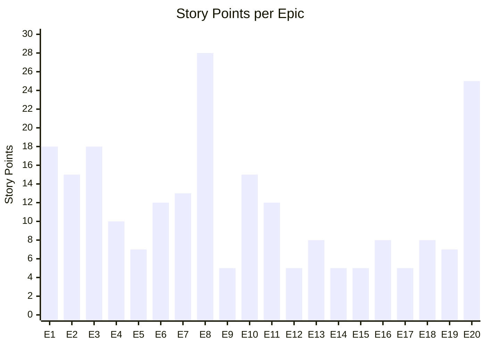
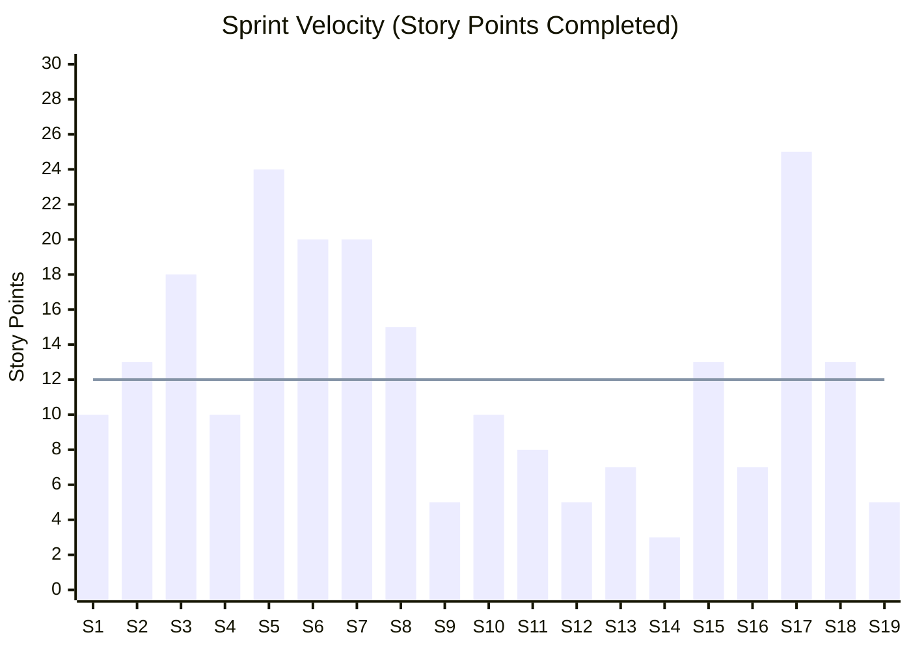
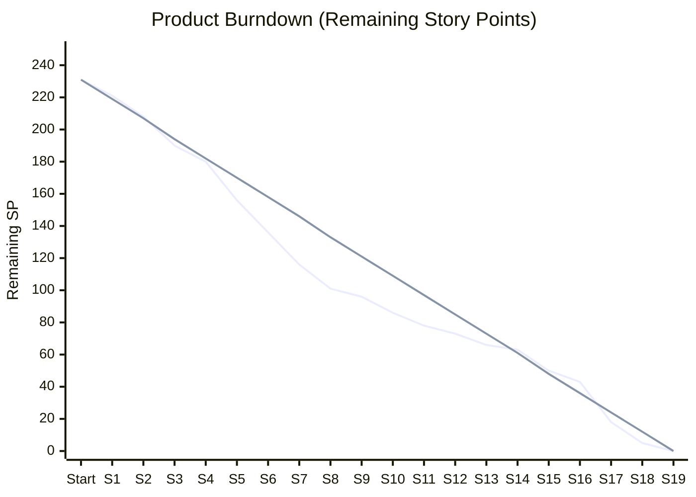
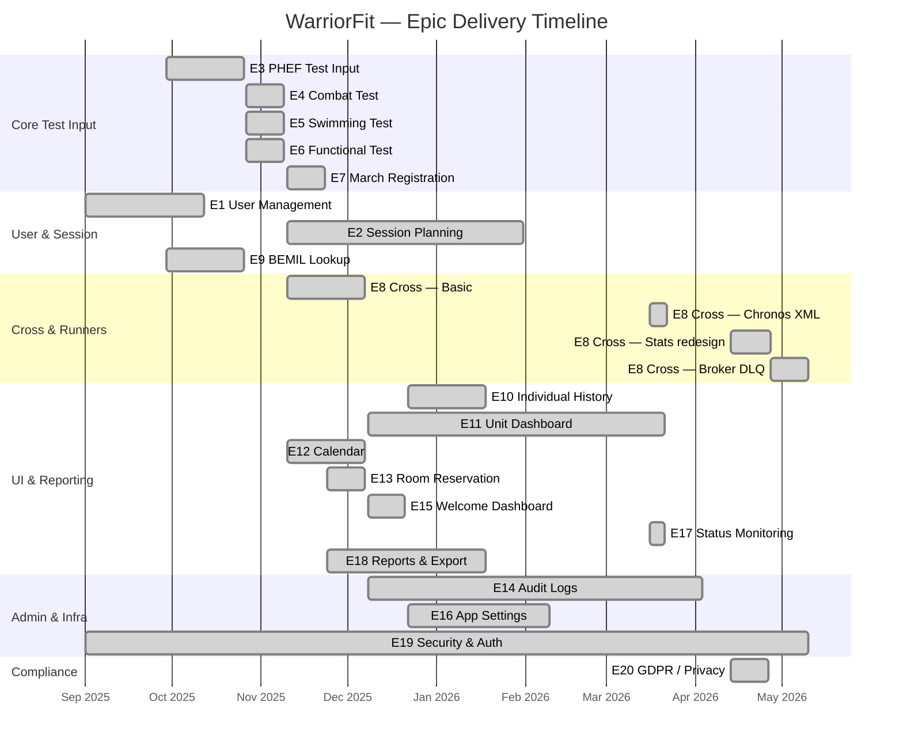
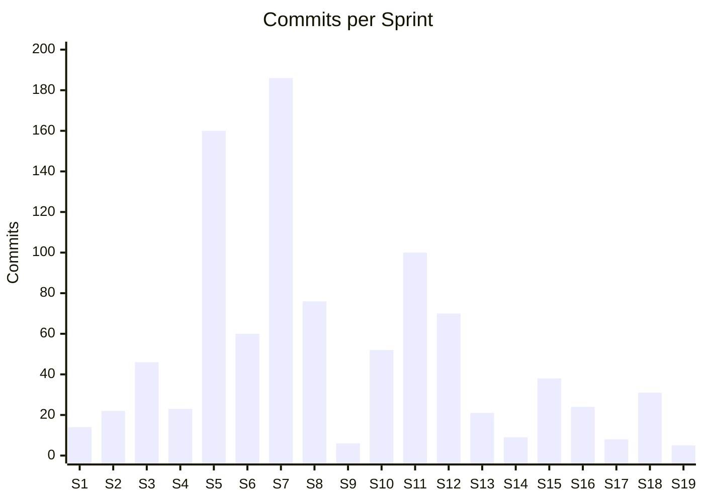

# WarriorFit — Scrum Sprint Analysis

**Project:** WarriorFit  
**Duration:** Sep 2025 – May 2026 (8.5 months · 19 sprints · 2-week cadence)  
**Team size:** 1 developer  
**Total delivered:** 231 story points · 1 012 commits · ~25 800 lines of Python

---

## 1. Product Backlog Summary

| Epic | Title                          | Stories | Points | Avg SP/Story | Priority band  |
|:----:|-------------------------------|:-------:|:------:|:------------:|----------------|
| 1    | User Management               | 6       | 18     | 3.0          | Must/Should    |
| 2    | Test Session Planning         | 5       | 15     | 3.0          | Must/Should    |
| 3    | PHEF Test Input               | 6       | 18     | 3.0          | Must           |
| 4    | Combat Test Input             | 3       | 10     | 3.3          | Must           |
| 5    | Swimming Test Input           | 3       | 7      | 2.3          | Should         |
| 6    | Functional Test Input         | 4       | 12     | 3.0          | Must           |
| 7    | March Registration            | 4       | 13     | 3.3          | Must/Should    |
| 8    | Cross Session & Statistics    | 7       | 28     | 4.0          | Must/Should    |
| 9    | BEMIL Personnel Lookup        | 2       | 5      | 2.5          | Must           |
| 10   | Individual Test History       | 4       | 15     | 3.8          | Must/Should    |
| 11   | Unit Status & Dashboard       | 4       | 12     | 3.0          | Must/Should    |
| 12   | Calendar Events               | 2       | 5      | 2.5          | Should/Could   |
| 13   | Fitness Room Reservation      | 3       | 8      | 2.7          | Should         |
| 14   | Audit Logs                    | 2       | 5      | 2.5          | Must           |
| 15   | Welcome Dashboard             | 2       | 5      | 2.5          | Must           |
| 16   | Application Settings          | 3       | 8      | 2.7          | Must/Should    |
| 17   | Status Monitoring             | 2       | 5      | 2.5          | Should         |
| 18   | Reports & Export              | 3       | 8      | 2.7          | Should         |
| 19   | Security & Authentication     | 4       | 7      | 1.8          | Must           |
| 20   | GDPR / Privacy & Self-Service | 7       | 25     | 3.6          | Must/Should    |
| **Σ**| **Total**                    | **80**  | **231**| **2.9**      |                |

### Story Point Legend

| Points | Effort           | Hours (avg) |
|:------:|-----------------|:-----------:|
| 1      | 2–4 h           | 3 h         |
| 2      | 4–8 h           | 6 h         |
| 3      | 1–2 days        | 12 h        |
| 5      | 2–3 days        | 20 h        |
| 8      | 3–5 days        | 32 h        |

**Total estimated effort:** 231 SP → **≈ 720 hours** (avg 3.1 h/SP × 231)

---

## 2. SP Distribution per Epic

Top 5 largest epics (55 % of total backlog):

| Rank | Epic                         | Points | % of total |
|:----:|------------------------------|:------:|:----------:|
| 1    | E8 — Cross & Statistics      | 28     | 12.1 %     |
| 2    | E20 — GDPR / Privacy         | 25     | 10.8 %     |
| 3    | E1 — User Management         | 18     | 7.8 %      |
| 4    | E3 — PHEF Test Input         | 18     | 7.8 %      |
| 5    | E2 — Test Session Planning   | 15     | 6.5 %      |

---

## 3. Sprint Planning (19 Sprints)

Sprints are 2 weeks. **Velocity** = story points completed. **Cumulative** = running total delivered.  
Commit count per sprint is from `git log --oneline` filtered by date.

| Sprint | Dates               | Commits | SP | Cumul. SP | Epics delivered / focus                        |
|:------:|---------------------|:-------:|:--:|:---------:|------------------------------------------------|
| S1     | Sep 01 – Sep 14     | 14      | 10 | 10        | Project setup, initial auth, login modal (E1 start, E19 start) |
| S2     | Sep 15 – Sep 28     | 22      | 13 | 23        | User CRUD, role model, BEMIL service wire-up (E1, E9) |
| S3     | Sep 29 – Oct 12     | 46      | 18 | 41        | PHEF form, time parsing, score calculation (E3) |
| S4     | Oct 13 – Oct 26     | 23      | 10 | 51        | PHEF calculator, email notifications, BEMIL modal (E3, E9) |
| S5     | Oct 27 – Nov 09     | 160     | 24 | 75        | Combat, Swimming, Functional, March tests (E4, E5, E6, E7) |
| S6     | Nov 10 – Nov 23     | 60      | 20 | 95        | Cross session basics, session planning, calendar (E2, E8, E12) |
| S7     | Nov 24 – Dec 07     | 186     | 20 | 115       | Cross runners, room reservation, bulk reports (E8, E13, E18) |
| S8     | Dec 08 – Dec 21     | 76      | 15 | 130       | Unit status dashboard, welcome page, audit logs start (E11, E15, E14) |
| S9     | Dec 22 – Jan 04     | 6       | 5  | 135       | Holiday sprint — bug fixes, individual history start (E10) |
| S10    | Jan 05 – Jan 18     | 52      | 10 | 145       | Individual PDF report, settings, HRM integration (E10, E16) |
| S11    | Jan 19 – Feb 01     | 100     | 8  | 153       | Search features, notifications, testing/hardening |
| S12    | Feb 02 – Feb 15     | 70      | 5  | 158       | **DI refactor** (PR #188) — tech-debt sprint, low new features |
| S13    | Feb 16 – Mar 01     | 21      | 7  | 165       | Security pass, password strength, deploy scripts (E19) |
| S14    | Mar 02 – Mar 15     | 9       | 3  | 168       | MkDocs, CI/CD, Docker prod — infrastructure sprint |
| S15    | Mar 16 – Mar 29     | 38      | 13 | 181       | Chronos XML import, UI redesign, runtime metrics (E8.6, E17) |
| S16    | Mar 30 – Apr 12     | 24      | 7  | 188       | About page, cross improvements, full audit log (E14) |
| S17    | Apr 13 – Apr 26     | 8       | 25 | 213       | GDPR full pass (E20) + Cross Stats redesign (E8.7) |
| S18    | Apr 27 – May 10     | 31      | 13 | 226       | Broker retry/DLQ, code quality refactor, security hardening (E8, E19) |
| S19    | May 11 – May 31     | 5       | 5  | 231       | Documentation, NIST CSF 2.0, finalization |

---

## 4. Velocity Chart

> Bars = actual velocity · Line = ideal average (231 SP ÷ 19 sprints = **12.2 SP/sprint**)

| Metric                  | Value       |
|-------------------------|-------------|
| Ideal avg velocity      | 12.2 SP/sprint |
| Peak velocity (S17)     | 25 SP       |
| Lowest velocity (S14)   | 3 SP        |
| Refactor sprint avg     | 4.0 SP (S12–S14) |
| Feature sprint avg      | 16.4 SP (S1–S11, S15–S19) |

---

## 5. Burndown Chart

> First line = actual remaining · Second line = ideal linear burndown

**Key observations:**
- Sprint 5 (Oct 27–Nov 9) shows a large drop: 4 epics (Combat/Swim/Functional/March) delivered in one sprint — highest commit density of the project (160 commits)
- Sprints 12–14 show a flat zone (only 15 SP total): the DI architectural refactor and CI/CD setup consumed engineering capacity without delivering user-facing features
- Sprint 17 shows a spike recovery: GDPR (Epic 20, 25 SP) closed in a single sprint driven by a regulatory deadline

---

## 6. Epic Delivery Timeline

---

## 7. Commit Density per Sprint

Commit count is a proxy for engineering effort. Spikes indicate high-intensity delivery periods.

| Sprint | Commits | Commits/SP | Notes                                       |
|:------:|:-------:|:----------:|---------------------------------------------|
| S5     | 160     | 6.7        | Highest density — 4 test-type epics in 2 weeks |
| S7     | 186     | 9.3        | Cross runners + room reservation + reports  |
| S11    | 100     | 12.5       | Many small bug-fixes and search refinements |
| S12    | 70      | 14.0       | DI refactor — many files, few new features  |
| S8     | 76      | 5.1        | Dashboard, Welcome, Audit start             |
| S14    | 9       | 3.0        | Infrastructure sprint — mostly config/docs  |
| S17    | 8       | 0.3        | Largest SP sprint with fewest commits — deep GDPR feature work |

> **Low commits/SP** = large, complex stories. **High commits/SP** = many small fixes or heavy refactoring.

---

## 8. Effort Estimate vs Story Points

Each story's estimated effort in developer-hours, cross-referenced against commit signal.

| Epic | SP | Est. Hours | Commit signal | Actual intensity |
|:----:|:--:|:----------:|:-------------:|-----------------|
| E1   | 18 | 54 h       | 31 commits    | As planned — iterative CRUD + security revisits |
| E2   | 15 | 45 h       | 64 commits    | Higher than planned — email, search, refresh added iteratively |
| E3   | 18 | 54 h       | 52 commits    | As planned — heavy calculator logic |
| E4   | 10 | 30 h       | 14 commits    | Slightly under — reused PHEF page pattern |
| E5   | 7  | 21 h       | 13 commits    | As planned — simplest test type |
| E6   | 12 | 36 h       | 20 commits    | As planned — functional calculator similar to PHEF |
| E7   | 13 | 39 h       | 26 commits    | As planned — march CRUD + email |
| E8   | 28 | 84 h       | 115 commits   | **Over** — grew to 7 stories across 4 phases (basic → Chronos → stats redesign → broker) |
| E9   | 5  | 15 h       | 11 commits    | As planned — reusable BEMIL service |
| E10  | 15 | 45 h       | ~20 commits   | As planned — aggregation + PDF generation |
| E11  | 12 | 36 h       | 50 commits    | Higher than planned — dashboard evolved over 4 months |
| E12  | 5  | 15 h       | 15 commits    | As planned |
| E13  | 8  | 24 h       | 31 commits    | Slightly higher — overlay CSS and overlap detection tricky |
| E14  | 5  | 15 h       | 28 commits    | Higher — nullable user_id fix, X-Forwarded-For, GDPR cross-over |
| E15  | 5  | 15 h       | ~10 commits   | As planned |
| E16  | 8  | 24 h       | ~25 commits   | As planned — YAML settings + Docker volume fix |
| E17  | 5  | 15 h       | 16 commits    | As planned — `psutil` metrics added quickly |
| E18  | 8  | 24 h       | 26 commits    | As planned — PDF/CSV/ZIP generation |
| E19  | 7  | 21 h       | 40 commits    | **Over** — security was an ongoing concern across all phases, not a single sprint |
| E20  | 25 | 75 h       | ~30 commits   | As planned — large but well-scoped GDPR pass |

---

## 9. Scrum Retrospective by Phase

### Phase 1 — Prototype (S1–S4, Sep–Oct 2025)

**What went well:**
- Strong initial delivery: login, user management, PHEF test input in 4 sprints
- BEMIL integration established early as a reusable service
- Commit frequency high and consistent

**What didn't go well:**
- Monolithic `app.py` and `DBService` god-class accumulated tech-debt quickly
- No DI, no layering — pages called services directly
- No tests at this stage

**Conclusion:** Classic healthy prototype phase — velocity high, architecture sacrificed for speed.

---

### Phase 2 — Feature Growth (S5–S8, Oct–Dec 2025)

**What went well:**
- Explosive feature delivery (4 test-type epics in Sprint 5)
- Cross session, room reservation, reports all delivered
- Dashboard and calendar complete

**What didn't go well:**
- Commit spikes (160, 186) suggest unplanned scope growth and reactive fixes
- Architecture not keeping up — controllers, services, and UI all merged in pages
- Cross App and Room Reservation were originally out-of-scope but consumed real sprints

**Conclusion:** Peak feature velocity phase. The product became fully functional here. Architecture debt grew proportionally.

---

### Phase 3 — Architectural Refactor (S11–S14, Jan–Mar 2026)

**What went well:**
- Full DI container (`dependency-injector`) properly wired — all 21 pages migrated
- Separated layers: UI → Controllers → Services → Repositories → ORM
- Async repositories, message broker extracted and stabilised

**What didn't go well:**
- Sprints 12–14 show the cost: only **15 SP** in 6 weeks — worst velocity period
- `app.py` had grown to 1 023 lines before the split
- 5 filename typos survived to Sprint 18 (corrected in the code quality refactor)

**Conclusion:** Necessary architectural investment. Velocity dip was acceptable for the long-term quality gain.

---

### Phase 4 — Hardening & DevOps (S13–S16, Feb–Apr 2026)

**What went well:**
- CI/CD pipeline (GitHub Actions, Ruff, mypy strict) established
- Docker production config with secret management
- OWASP review triggered concrete fixes (bcrypt → Argon2id, audit log, rate limiting)
- User manual, MkDocs, architecture docs produced

**What didn't go well:**
- Sprint 14 had only 9 commits and 3 SP — infrastructure work is invisible in velocity
- Security concerns required multiple revisits (bcrypt → Argon2id → NIST CSF → OWASP → IDOR → session scoping)

**Conclusion:** Maturity sprint. The application moved from "it works" to "production-ready".

---

### Phase 5 — Security & Compliance (S17–S19, Apr–May 2026)

**What went well:**
- Epic 20 (GDPR, 25 SP) delivered in a single sprint (S17) — well-scoped and focused
- Cross Statistics redesign (Story 8.7, 5 SP) completed in same sprint
- Broker DLQ, NIST CSF 2.0, PostgreSQL TLS, session isolation all completed

**What didn't go well:**
- Sprint 17 had only 8 commits for 25 SP — very deep feature stories with complex DB migrations
- Security hardening spanned 5 separate PRs (#191, #193, #194, #214, #216, #217) — indicates incremental discovery rather than upfront security design

**Conclusion:** Compliance deadline drove the highest SP sprint. Retrospectively, security stories should have been distributed earlier rather than clustered at the end.

---

## 10. Definition of Done (DoD)

The following criteria were applied for all user stories:

| Criterion                                       | Applied from |
|-------------------------------------------------|:------------:|
| Feature implemented and manually tested         | Sprint 1     |
| No regressions on other pages                   | Sprint 1     |
| Audit log records relevant actions              | Sprint 8     |
| Email notification sent where applicable        | Sprint 6     |
| Async repository / no blocking I/O              | Sprint 12    |
| `ruff check` passes (line-length 100, E/F/W/I)  | Sprint 13    |
| `mypy --strict` clean                           | Sprint 15    |
| Role guard enforced server-side                 | Sprint 18    |
| CHANGELOG entry added                           | Sprint 12    |

---

## 11. Story Status per Epic

| Epic | Status     | Notes                                              |
|:----:|:----------:|----------------------------------------------------|
| E1   | ✅ Done    | All 6 stories; password reveal, strength validation added post-MVP |
| E2   | ✅ Done    | All 5 stories; notifications added in Sprint 11    |
| E3   | ✅ Done    | All 6 stories; MOM integration for PHEF in Phase 5 |
| E4   | ✅ Done    | All 3 stories                                      |
| E5   | ✅ Done    | All 3 stories                                      |
| E6   | ✅ Done    | All 4 stories                                      |
| E7   | ✅ Done    | All 4 stories                                      |
| E8   | ✅ Done    | All 7 stories — grew from 3 to 7 stories during the project |
| E9   | ✅ Done    | Both stories; BEMIL modal reused on 7 pages        |
| E10  | ✅ Done    | All 4 stories                                      |
| E11  | ✅ Done    | All 4 stories; dashboard evolved significantly     |
| E12  | ✅ Done    | Both stories                                       |
| E13  | ✅ Done    | All 3 stories                                      |
| E14  | ✅ Done    | Both stories                                       |
| E15  | ✅ Done    | Both stories                                       |
| E16  | ✅ Done    | All 3 stories; Docker volume bug fixed post-delivery |
| E17  | ✅ Done    | Both stories; psutil metrics added in Sprint 15    |
| E18  | ✅ Done    | All 3 stories                                      |
| E19  | ✅ Done    | All 4 stories; revisited in every phase            |
| E20  | ✅ Done    | All 7 stories; serviceman login TODO (SSO) noted   |

**80 / 80 stories delivered.**

---

## 12. Open Risks / Follow-up

| # | Item                                          | Epic | Priority |
|:-:|-----------------------------------------------|:----:|:--------:|
| 1 | Serviceman login mode — password not verified yet (SSO / dedicated creds pending) | E20  | High     |
| 2 | No admin UI for dead-letter queue management  | E8   | Medium   |
| 3 | No metrics endpoint (Prometheus / health JSON)| E17  | Low      |
| 4 | MkDocs site still marked "In Development"     | Docs | Low      |
